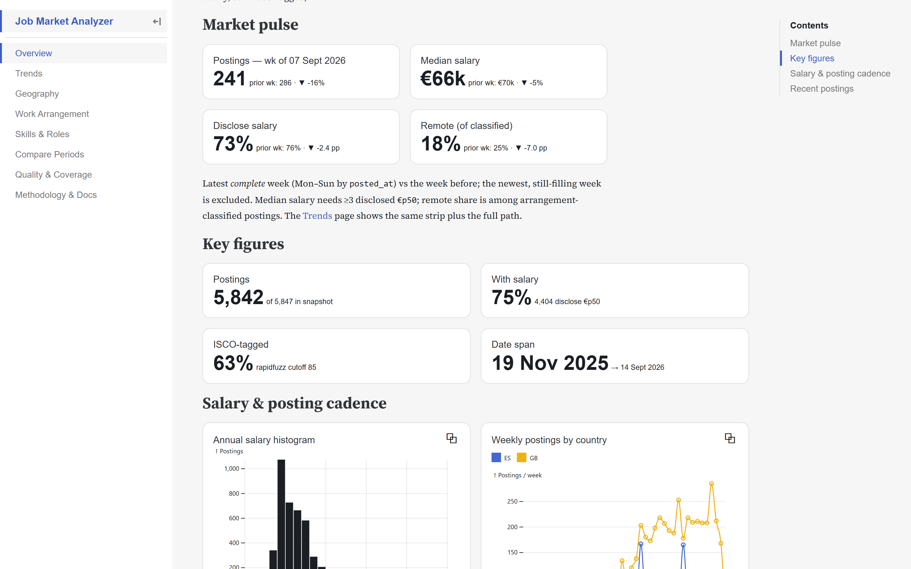
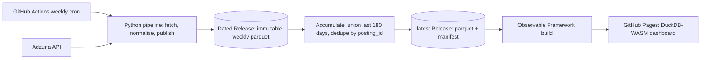
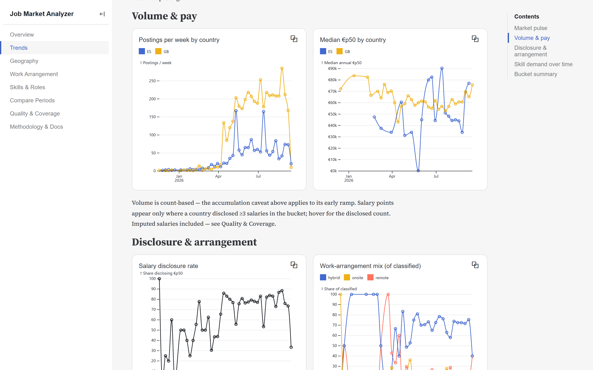

# jobmarket_analyzer

**Weekly EU job-market intelligence with no backend.** A GitHub Actions cron ingests Adzuna postings, normalises them to EUR / ISCO-08 / ESCO skills, accumulates a rolling 6-month Parquet corpus on GitHub Releases, and serves an eight-page DuckDB-WASM dashboard from GitHub Pages — running unattended since May 2026.

[](https://github.com/alex-wu/jobmarket_analyzer/actions/workflows/ci.yml)
[](https://github.com/alex-wu/jobmarket_analyzer/actions/workflows/pages.yml)
[](https://github.com/alex-wu/jobmarket_analyzer/actions/workflows/codeql.yml)
[](https://scorecard.dev/viewer/?uri=github.com/alex-wu/jobmarket_analyzer)
[](LICENSE)

**▶ Live dashboard: <https://alex-wu.github.io/jobmarket_analyzer/>**

[](https://alex-wu.github.io/jobmarket_analyzer/)

- **Free tier end to end.** Adzuna free API (~30 calls/week of a 250/day quota), GitHub Actions, Releases as CDN, Pages as host. No server, no database, no paid services.
- **Every number is reproducible.** Weekly runs write immutable dated Releases; the `latest` dataset is a pure function over the last 180 days of them. Charts query the Parquet in your browser via DuckDB-WASM.
- **Built to be trusted.** 374 tests, `mypy --strict`, ruff, CodeQL, OpenSSF Scorecard, quality gate on every run, 26 architecture decision records, a red run files an issue.



[](https://alex-wu.github.io/jobmarket_analyzer/trends)

---

## Status

v1 live and running unattended. v1 ships **Adzuna-only** ([ADR-017](DECISIONS.md#adr-017--scope-cut-to-adzuna-only-post-v1-stabilisation)), multi-country (gb, es active; 7-country EU expansion planned) on a **weekly** Monday 06:00 UTC cron with `workflow_dispatch` for on-demand runs. Each preset produces a distinctly named `latest-{preset_id}.parquet` accumulated from the immutable dated archive ([ADR-019](DECISIONS.md#adr-019--multi-preset-latest-preset_id-release-naming), [ADR-020](DECISIONS.md#adr-020--accumulated-dataset-via-pure-function-recompute)). ATS adapters (Greenhouse / Lever / Ashby / Personio) and benchmark adapters (CSO / OECD / Eurostat) remain in the codebase, shelved by preset config until the multi-country unified merge proves stable end-to-end — see [ADR-017](DECISIONS.md#adr-017--scope-cut-to-adzuna-only-post-v1-stabilisation). Pipeline runs on Node 24 actions, Dependabot (weekly grouped npm + pip + actions), CodeQL (Python + JS), OpenSSF Scorecard, actionlint, and Dependabot auto-merge for patch+minor. Branch protection on `main` requires `test` + CodeQL checks. Day-to-day operations: [docs/operations.md](docs/operations.md). CI/CD reference: [docs/ci-cd-practices.md](docs/ci-cd-practices.md). Architecture: [DECISIONS.md](DECISIONS.md) + [docs/architecture.md](docs/architecture.md).

**v1 preset:** `data_analyst_eu` — data-analyst roles across gb + es (7-country EU expansion planned). The pipeline is preset-driven — `config/runs/*.yaml` declare what gets ingested. Adding a new role/geography today means a YAML file, a matrix entry in `refresh.yml`, and un-hardcoding `PRESET_ID` in `pages.yml` + `site/src/data/postings.parquet.js` (to be simplified when the multi-preset switcher lands, [ADR-019](DECISIONS.md#adr-019--multi-preset-latest-preset_id-release-naming)). Presets run in parallel via GitHub Actions matrix; each produces its own `latest-{preset_id}.parquet`.

---

## What it does

1. **Ingest** — One Adzuna source adapter fetches across the active countries (gb, es) at ~30 API calls/week (3 keywords × 5 pages × 2 countries — a small fraction of the free-tier quota); 7-country EU expansion is planned. See [ADR-017](DECISIONS.md#adr-017--scope-cut-to-adzuna-only-post-v1-stabilisation) for why the active source set is Adzuna-only, [ADR-018](DECISIONS.md#adr-018--weekly-cadence--multi-country-single-run) for cadence rationale.
2. **Normalise** — Currency to EUR via ECB reference rates, salary period to annual, fuzzy-match titles to ISCO-08 occupation codes via ESCO, extract ESCO Pillar B skills via Aho-Corasick (scoped by preset `isco_focus`, [ADR-023](DECISIONS.md#adr-023--skill-enrichment-via-esco-pillar-b--aho-corasick-scoped-by-preset-isco_focus)), cross-source dedupe by normalised-URL hash (the adapter already collapses duplicate `posting_id`s within a run).
3. **Archive** — Each weekly run writes an immutable `data-{preset_id}-YYYY-MM-DD.parquet` to its own dated GitHub Release. Never modified, never deleted ([ADR-020](DECISIONS.md#adr-020--accumulated-dataset-via-pure-function-recompute)).
4. **Accumulate** — Publish step unions the last 180 days of dated releases for the preset, dedupes by `posting_id`, derives `first_seen_at` / `last_seen_at`, re-clobbers `latest-{preset_id}` Release with the unified parquet. Pure function — `latest` is recomputable from the archive at any time.
5. **Visualise** — Eight-page Observable Framework dashboard on GitHub Pages (overview, weekly trends, geography choropleth, work arrangement, skills & roles, period-over-period compare, quality, methodology) reads `latest-{preset_id}.parquet` for the active preset (currently hardcoded to `data_analyst_eu`; preset switcher queued per ADR-019). Every posting links back to its source URL.

---

## Quick start

Prerequisites: [uv](https://docs.astral.sh/uv/), Python 3.12 (uv will install), Node 24+ (for the dashboard site).

```bash
git clone https://github.com/alex-wu/jobmarket_analyzer.git
cd jobmarket_analyzer
uv sync
cp .env.example .env   # then fill in ADZUNA_APP_ID / ADZUNA_APP_KEY

# Sanity-check the preset before any HTTP calls (recommended for forks)
uv run jobpipe validate --preset config/runs/data_analyst_eu.yaml

# Run the v1 preset end-to-end against the live API
uv run jobpipe fetch --preset config/runs/data_analyst_eu.yaml --verbose
uv run jobpipe normalise --preset config/runs/data_analyst_eu.yaml
uv run jobpipe publish --preset config/runs/data_analyst_eu.yaml
uv run jobpipe gate --manifest data/publish/<run_id>/manifest.json --preset config/runs/data_analyst_eu.yaml

# Or skip live fetching and download the production sample from the latest release:
gh release download latest-data_analyst_eu -p "latest-data_analyst_eu.parquet" -p "manifest.json" \
  -R alex-wu/jobmarket_analyzer -D data/gh_databuild_samples/ --clobber

# Build the dashboard against the local Parquet sample
cd site && npm install && npm run dev   # http://127.0.0.1:3000
```

Live demo: <https://alex-wu.github.io/jobmarket_analyzer/>

For the day-to-day local-dev / refresh / push loops, see [docs/operations.md](docs/operations.md).

---

## Architecture (one-liner)

GitHub Actions weekly cron + matrix over presets → Python pipeline (`uv` env) → archive (dated Releases) → accumulate (pure-function union of last 180 days) → `latest-{preset_id}` Release as CDN → Observable Framework site (DuckDB-WASM; preset switcher queued) → GitHub Pages.

Full dataflow diagram: [docs/architecture.md](docs/architecture.md). Architectural decisions: [DECISIONS.md](DECISIONS.md).

---

## Extending

- **New preset (role / geography)** — copy `config/runs/data_analyst_eu.yaml`, change `preset_id`, `keywords`, `countries`. Then add it to `strategy.matrix.preset` in `.github/workflows/refresh.yml`, and un-hardcode `PRESET_ID` in `.github/workflows/pages.yml` and `site/src/data/postings.parquet.js` (both pin `data_analyst_eu` today). To be simplified when multi-preset enumeration + the dashboard switcher land ([ADR-019](DECISIONS.md#adr-019--multi-preset-latest-preset_id-release-naming)).
- **New source adapter** — out of scope for v1 per [ADR-017](DECISIONS.md#adr-017--scope-cut-to-adzuna-only-post-v1-stabilisation). The pluggable adapter pattern ([ADR-008](DECISIONS.md#adr-008--pluggable-adapter-pattern-sources--benchmarks)) survives — see [docs/adding-a-source.md](docs/adding-a-source.md) for the post-v1 pattern. Reactivation criteria documented in ADR-017.
- **New benchmark adapter** — same status; follows the same Protocol pattern under `src/jobpipe/benchmarks/` (see the note in [docs/adding-a-source.md](docs/adding-a-source.md)).

---

## Deploy

The dashboard lives at <https://alex-wu.github.io/jobmarket_analyzer/>. Two workflows back it:

- `.github/workflows/refresh.yml` — weekly Monday 06:00 UTC cron + manual dispatch, matrix over presets (currently just `data_analyst_eu`). Runs the pipeline, uploads accumulated `latest-{preset_id}.parquet` + `manifest.json` to `latest-{preset_id}` + dated `data-{preset_id}-YYYY-MM-DD` GitHub Releases.
- `.github/workflows/pages.yml` — downloads the hardcoded `data_analyst_eu` release, builds `site/` with Observable Framework, smoke-tests it, deploys via `actions/deploy-pages`. Triggers on push to `main` under `site/**` or to the workflow file itself, on `refresh.yml` completion (via `workflow_run`), or via manual `workflow_dispatch`.

One-time manual GitHub setup (secrets, Pages source, workflow permissions, secret scanning) is checklisted in [docs/github-setup.md](docs/github-setup.md). Architectural rationale: [ADR-004](DECISIONS.md#adr-004--storage--delivery-parquet-via-github-releases-as-cdn), [ADR-016](DECISIONS.md#adr-016--github-pages-deploy-via-actionsdeploy-pages-from-the-monorepo), [ADR-019](DECISIONS.md#adr-019--multi-preset-latest-preset_id-release-naming).

---

## Open questions

What we know we haven't solved yet (Adzuna attribution footer, gate calibration, preset switcher, …) lives in [docs/open-questions.md](docs/open-questions.md).

Picking the project up for a working session? Start at [docs/bootstrap.md](docs/bootstrap.md) — read order, state snapshot, first checks, and the prioritised backlog.

---

## Project status

**Shipped:**

- End-to-end weekly pipeline: Adzuna ingest → EUR/ISCO/skills normalisation → dated + accumulated Releases → Pages rebuild, running unattended with failure alerting (a red run files a GitHub issue).
- Schema v3: `work_arrangement` ternary via a multilingual keyword tagger, ESCO Pillar B skills ([ADR-022](DECISIONS.md#adr-022--postingschema-v2--persist-5-adzuna-fields--skills)–[025](DECISIONS.md#adr-025--postingschema-v3--drop-dead-weight-cols-ternary-work_arrangement-details-off-by-default)). Only `experience_level` remains unfilled — Adzuna carries no signal for it.
- Eight-page dashboard ([ADR-026](DECISIONS.md#adr-026--dashboard-v2-restructure--europe-choropleth-page-consolidation-csv-export)): Europe choropleth, work-arrangement surface + global filter, top-skills chart, period-over-period compare page, weekly/monthly trends page, week-over-week market-pulse strip on Overview and Trends (latest complete period vs prior), CSV export on every data page except Compare, URL-persisted filters ([ADR-024](DECISIONS.md#adr-024--filter-state-persistence-via-url-search-params)).
- Hardening for unattended runs: credential scrubbing across wrapped errors, real retry semantics (5xx/429/transport only), quarantine of malformed rows, gate command.
- CI/CD: CodeQL, Dependabot (grouped weekly, auto-merge patch+minor), OpenSSF Scorecard, actionlint, branch protection.

**Next** (priority order in [docs/portfolio-audit.md](docs/portfolio-audit.md); ops detail in [docs/open-questions.md](docs/open-questions.md)):

- [x] Adzuna attribution wording — dashboard footer now reads "The Adzuna API" + link (ToS hygiene).
- [ ] Post-publish artifact correctness gate + `min_total_rows` calibration against real weekly manifests.
- [ ] Dashboard preset switcher — the loader still hardcodes `data_analyst_eu` ([ADR-019](DECISIONS.md#adr-019--multi-preset-latest-preset_id-release-naming)).
- [ ] Widen to 7 countries, then a findings page (audit #2, #3).
- [ ] Second preset (e.g. `software_developer_eu`), first tagged release.

---

## License

Apache-2.0. See [LICENSE](LICENSE). Third-party attributions in [NOTICE.md](NOTICE.md).

Contributions welcome — see [CONTRIBUTING.md](CONTRIBUTING.md).
