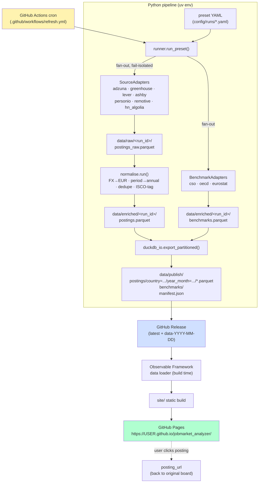

# Architecture

End-to-end dataflow for the v1 portfolio build. Architectural decisions and their WHY live in [DECISIONS.md](../DECISIONS.md).

## High-level dataflow

## Component responsibilities

| Component | Path | Responsibility |
|---|---|---|
| Source adapters | `src/jobpipe/sources/<name>.py` | HTTP + JSON → normalised DataFrame. **All HTTP lives here.** |
| Benchmark adapters | `src/jobpipe/benchmarks/<name>.py` | HTTP + JSON-stat/SDMX → normalised DataFrame. |
| Runner | `src/jobpipe/runner.py` | Preset loader, fan-out, fail-isolation, schema validation entry point. |
| Normalise | `src/jobpipe/normalise.py` | **Pure**. FX, period, dedupe, ISCO tag. |
| ESCO/ISCO tagger | `src/jobpipe/esco.py` | Title → ISCO-08 4-digit code (rapidfuzz + optional LLM). |
| FX | `src/jobpipe/fx.py` | ECB daily reference CSV → EUR conversion. |
| DuckDB I/O | `src/jobpipe/duckdb_io.py` | Partitioned Parquet export, manifest writer. |
| CLI | `src/jobpipe/cli.py` | `jobpipe fetch | normalise | publish` Typer commands. |
| Site | `site/` | Observable Framework project. DuckDB-WASM in browser. |

## Schemas (the contract)

- **`PostingSchema`** (`src/jobpipe/schemas.py`): the shape every source adapter must emit. Salary fields are pre-converted to EUR. `posting_url` is required — every datapoint links back to its source.
- **`BenchmarkSchema`**: official wage data, joined to postings via `(isco_code, country)`.

## Failure model

- Source adapters wrapped in try/except by the runner. One source's HTTP error → others succeed → run exits 0 with a warning summary.
- Zero postings across all enabled sources for a preset = exit 2 (loud failure, dashboard doesn't refresh).
- `gh release upload` retried by GitHub Actions native retry policy. The `latest` release is re-clobbered atomically per run; a dated `data-YYYY-MM-DD` release provides audit history.

## Refresh cadence

- **Default:** daily, 06:00 UTC, via `.github/workflows/refresh.yml`.
- **Per-source override:** `min_interval_hours` in preset YAML (e.g. Adzuna may need weekly throttling if the free tier is 250 calls/month — verify in P1).
- **Manual:** `workflow_dispatch` on the same workflow for ad-hoc refreshes.
