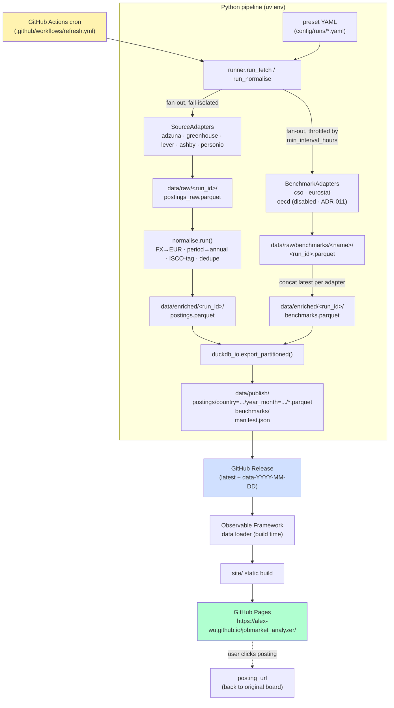

# Architecture

End-to-end dataflow for the v1 portfolio build. Architectural decisions and their WHY live in [DECISIONS.md](../DECISIONS.md).

## High-level dataflow

## Component responsibilities

| Component | Path | Responsibility |
|---|---|---|
| Source adapters | `src/jobpipe/sources/<name>.py` | HTTP + JSON → normalised DataFrame. **All HTTP lives here.** |
| Benchmark adapters | `src/jobpipe/benchmarks/<name>.py` | HTTP + JSON-stat/SDMX → normalised DataFrame. Throttled per-adapter via `min_interval_hours` (mtime of newest parquet under `data/raw/benchmarks/<name>/`). |
| Benchmark helpers | `src/jobpipe/benchmarks/_common.py` | `last_fetch_mtime`, `should_skip`, `convert_benchmark_to_eur`. |
| Runner | `src/jobpipe/runner.py` | Preset loader, fan-out (`fetch_sources` + `fetch_benchmarks`), fail-isolation, schema validation entry point, sibling-parquet writer. |
| Normalise | `src/jobpipe/normalise.py` | **Pure**. FX, period, ISCO tag, dedupe. Accepts an injected `labels_df` for purity in tests. |
| ISCO tagger | `src/jobpipe/isco/` | `loader.py` reads the static ESCO snapshot; `tagger.py` runs rapidfuzz token-set matching at score cutoff 88. Pure. |
| ESCO snapshot | `config/esco/isco08_labels.parquet` | 2 137 labels × 436 ISCO-08 unit groups, built by `scripts/build_esco_snapshot.py` (ADR-010). |
| LLM | `src/jobpipe/llm.py` | Optional OpenAI-compatible client. **Stub for v1** — contract defined, calls raise. Real client lands post-v1. See [ADR-013](../DECISIONS.md#adr-013--hn-algolia--llm-client-descoped-from-v1). |
| FX | `src/jobpipe/fx.py` | ECB daily reference CSV → EUR conversion. |
| DuckDB I/O | `src/jobpipe/duckdb_io.py` | Partitioned Parquet export, manifest writer (P5). |
| CLI | `src/jobpipe/cli.py` | `jobpipe fetch \| normalise \| publish` Typer commands. Installs the URL-credential scrub filter on httpx/httpcore loggers per [ADR-015](../DECISIONS.md#adr-015--httpx-credential-redaction-filter-on-the-cli-logger). |
| Configs | `config/runs/*.yaml`, `config/companies/*.yaml` | Run presets (what to fetch) and shared ATS company slug lists. Adding a role/geo = new YAML, no code. |
| Test fixtures | `tests/fixtures/<area>/<adapter>/` | Hand-built trimmed JSON samples driving `httpx.MockTransport` unit tests (replaces VCR after P3). |
| Refresh workflow | `.github/workflows/refresh.yml` | Cron + `workflow_dispatch`. Runs the pipeline, uploads to `latest` + `data-YYYY-MM-DD` Releases. Lands in **P5**. |
| Pages workflow | `.github/workflows/pages.yml` | Builds `site/`, uploads a Pages artefact, deploys via `actions/deploy-pages`. Lands in **P7**. See [ADR-016](../DECISIONS.md#adr-016--github-pages-deploy-via-actionsdeploy-pages-from-the-monorepo). |
| Site | `site/` | Observable Framework project. DuckDB-WASM in browser. Lands in **P6**. |

## Schemas (the contract)

- **`PostingSchema`** (`src/jobpipe/schemas.py`): the shape every source adapter must emit. Salary fields are pre-converted to EUR. `posting_url` is required — every datapoint links back to its source.
- **`BenchmarkSchema`**: official wage data, joined to postings via `(isco_code, country)`.

## Failure model

- Source adapters wrapped in try/except by the runner. One source's HTTP error → others succeed → run exits 0 with a warning summary.
- Zero postings across all enabled sources for a preset = exit 2 (loud failure, dashboard doesn't refresh).
- `gh release upload` retried by GitHub Actions native retry policy. The `latest` release is re-clobbered atomically per run; a dated `data-YYYY-MM-DD` release provides audit history.

## Refresh cadence

- **Default:** daily, 06:00 UTC, via `.github/workflows/refresh.yml` (lands in P5).
- **Per-source override:** `min_interval_hours` in preset YAML (e.g. Adzuna at `24h`).
- **Per-benchmark override:** same `min_interval_hours` knob, enforced by `runner.fetch_benchmarks` via the mtime of the newest parquet under `data/raw/benchmarks/<name>/`. Defaults: CSO 168h (weekly recheck of quarterly cube), Eurostat/OECD 720h (monthly recheck of annual-or-rarer series).
- **Manual:** `workflow_dispatch` on the same workflow for ad-hoc refreshes.

## Deploy

- **Refresh (P5):** `.github/workflows/refresh.yml` runs the pipeline daily, uploads partitioned Parquet to a `latest` GitHub Release (re-clobbered each run) and a dated `data-YYYY-MM-DD` Release for audit history. See [ADR-004](../DECISIONS.md#adr-004--storage--delivery-parquet-via-github-releases-as-cdn).
- **Pages (P7):** `.github/workflows/pages.yml` builds `site/` with Observable Framework, uploads via `actions/upload-pages-artifact`, deploys via `actions/deploy-pages`. Triggered by `workflow_run` after `refresh.yml` succeeds. See [ADR-016](../DECISIONS.md#adr-016--github-pages-deploy-via-actionsdeploy-pages-from-the-monorepo).
- **One-time GitHub configuration** — secrets, Pages source, workflow permissions — is checklisted in [`docs/github-setup.md`](github-setup.md).
