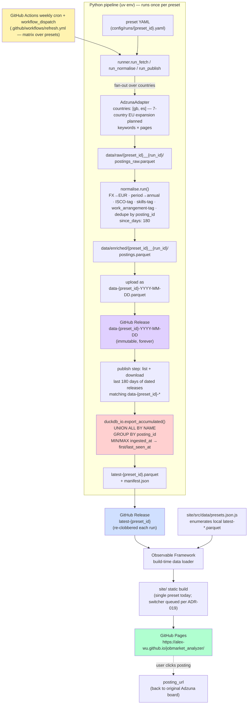

# Architecture

End-to-end dataflow for the v1 portfolio build (post-2026-05-17 scope pivot). Architectural decisions and their WHY live in [DECISIONS.md](../DECISIONS.md). Multi-source pre-pivot semantics are preserved in [ADR-003](../DECISIONS.md#adr-003--ingestion-api-first-no-jobspy) / [ADR-008](../DECISIONS.md#adr-008--pluggable-adapter-pattern-sources--benchmarks); scope cut is [ADR-017](../DECISIONS.md#adr-017--scope-cut-to-adzuna-only-post-v1-stabilisation).

## High-level dataflow


```mermaid
flowchart TD
    cron["GitHub Actions weekly cron + workflow_dispatch<br/>(.github/workflows/refresh.yml — matrix over presets)"] --> runner

    subgraph pipeline["Python pipeline (uv env) — runs once per preset"]
        direction TB
        preset["preset YAML<br/>(config/runs/{preset_id}.yaml)"] --> runner["runner.run_fetch / run_normalise / run_publish"]
        runner -->|fan-out over countries| adzuna["AdzunaAdapter<br/>countries: [gb, es] — 7-country EU expansion planned<br/>keywords × pages"]
        adzuna --> raw["data/raw/{preset_id}__{run_id}/<br/>postings_raw.parquet"]
        raw --> normalise["normalise.run()<br/>FX→EUR · period→annual · ISCO-tag · skills-tag · work_arrangement-tag · dedupe by posting_id<br/>since_days: 180"]
        normalise --> enriched["data/enriched/{preset_id}__{run_id}/<br/>postings.parquet"]
        enriched --> archive_upload["upload as<br/>data-{preset_id}-YYYY-MM-DD.parquet"]
        archive_upload --> dated_release["GitHub Release<br/>data-{preset_id}-YYYY-MM-DD<br/>(immutable, forever)"]
        dated_release --> accum_download["publish step: list + download<br/>last 180 days of dated releases<br/>matching data-{preset_id}-*"]
        accum_download --> accumulate["duckdb_io.export_accumulated()<br/>UNION ALL BY NAME<br/>GROUP BY posting_id<br/>MIN/MAX ingested_at → first/last_seen_at"]
        accumulate --> latest_artifact["latest-{preset_id}.parquet<br/>+ manifest.json"]
    end

    latest_artifact --> latest_release["GitHub Release<br/>latest-{preset_id}<br/>(re-clobbered each run)"]
    latest_release --> loader["Observable Framework<br/>build-time data loader"]
    presets_manifest["site/src/data/presets.json.js<br/>enumerates local latest-*.parquet"] --> loader
    loader --> site["site/ static build<br/>(single preset today; switcher queued per ADR-019)"]
    site --> pages["GitHub Pages<br/>https://alex-wu.github.io/jobmarket_analyzer/"]
    pages -.->|user clicks posting| source_url["posting_url<br/>(back to original Adzuna board)"]

    style cron fill:#fff3b0
    style pages fill:#b0ffd0
    style latest_release fill:#d0e0ff
    style dated_release fill:#e0d0ff
    style accumulate fill:#ffd0d0
```

Shelved infrastructure (in tree, `enabled: false` in active presets, can return via new ADR once multi-country merge is proven stable):

- ATS source adapters: `greenhouse`, `lever`, `ashby`, `personio`
- Benchmark adapters: `cso`, `oecd` (also Cloudflare-gated per [ADR-011](../DECISIONS.md#adr-011--oecd-sdmx-adapter-ships-disabled-cloudflare-bot-protection)), `eurostat`
- LLM stub: `src/jobpipe/llm.py`

## Component responsibilities

| Component | Path | Responsibility |
|---|---|---|
| Source adapter (active) | `src/jobpipe/sources/adzuna.py` | HTTP + JSON → normalised DataFrame. Loops over `countries × keywords × pages`. **All HTTP lives here.** |
| Source adapters (shelved) | `src/jobpipe/sources/{greenhouse,lever,ashby,personio}.py` | Per [ADR-017](../DECISIONS.md#adr-017--scope-cut-to-adzuna-only-post-v1-stabilisation), kept in tree but unwired by preset config. |
| Benchmark adapters (shelved) | `src/jobpipe/benchmarks/{cso,oecd,eurostat}.py` | Per [ADR-017](../DECISIONS.md#adr-017--scope-cut-to-adzuna-only-post-v1-stabilisation), kept in tree but unwired. |
| Runner | `src/jobpipe/runner.py` | Preset loader, country fan-out, schema validation, sibling-parquet writer, accumulation orchestration. |
| Normalise | `src/jobpipe/normalise.py` | **Pure**. FX, period, ISCO tag, skills tag, work_arrangement tag, dedupe by `posting_id`. |
| ISCO tagger | `src/jobpipe/isco/` | `loader.py` reads the static ESCO snapshot; `tagger.py` runs rapidfuzz token-set matching at score cutoff 85. Pure. |
| Skills tagger | `src/jobpipe/skills/` | `loader.py` reads the static ESCO Pillar B snapshot; `tagger.py` runs an Aho-Corasick scan with word-boundary post-filter, scoped at runtime by `preset.isco_focus`. Adds `skills: list[str]`. Pure. See [ADR-023](../DECISIONS.md#adr-023--skill-enrichment-via-esco-pillar-b--aho-corasick-scoped-by-preset-isco_focus). |
| Work-arrangement tagger | `src/jobpipe/work_arrangement/` | `tagger.py` runs `\b`-anchored multilingual regex (en/es/de/fr/it) against `title + description`. Tiebreak hybrid > remote > onsite. Populates `work_arrangement: str`. `fetcher.py` adds opt-in Adzuna `/v1/api/jobs/{country}/details/{id}` calls to recover the full body (off by default per ADR-025); preset YAML toggle `normalise.work_arrangement.enabled`. Pure tagger + IO-side fetcher kept separate. |
| ESCO snapshot (occupations) | `config/esco/isco08_labels.parquet` | 2 137 labels × 436 ISCO-08 unit groups, built by `scripts/build_esco_snapshot.py` ([ADR-010](../DECISIONS.md#adr-010--esco-label-snapshot-built-by-walking-the-isco-concept-tree)). |
| ESCO snapshot (skills) | `config/esco/skills_labels.parquet` | 13 896 ESCO Pillar B concepts (skill / knowledge), sourced from the `tabiya-tech/tabiya-open-dataset` mirror (v1.1.1) by `scripts/build_esco_skills_snapshot.py` ([ADR-023](../DECISIONS.md#adr-023--skill-enrichment-via-esco-pillar-b--aho-corasick-scoped-by-preset-isco_focus)). |
| FX | `src/jobpipe/fx.py` | ECB daily reference CSV → EUR conversion. |
| DuckDB I/O | `src/jobpipe/duckdb_io.py` | Partitioned/flat Parquet export; **`export_accumulated()` (P13)** unions dated archive within a window and computes `first_seen_at` / `last_seen_at` per `posting_id`. Manifest writer. |
| CLI | `src/jobpipe/cli.py` | `jobpipe fetch \| normalise \| publish \| gate \| validate` Typer commands. Installs the URL-credential scrub filter on httpx/httpcore loggers per [ADR-015](../DECISIONS.md#adr-015--httpx-credential-redaction-filter-on-the-cli-logger). |
| Configs | `config/runs/{preset_id}.yaml` | Run presets (what to fetch). Adding a role/geo = new YAML + new matrix entry in `refresh.yml`, plus (until the switcher lands) un-hardcoding the preset in `pages.yml` and `site/src/data/postings.parquet.js`. |
| Archived presets | `config/runs/_archived/` | Pre-pivot presets retained for historical reference. |
| Test fixtures | `tests/fixtures/<area>/<adapter>/` | Hand-built trimmed JSON samples driving `httpx.MockTransport` unit tests (replaces VCR after P3). |
| Refresh workflow | `.github/workflows/refresh.yml` | Weekly Monday 06:00 UTC cron + `workflow_dispatch`. Matrix over presets. Per-preset concurrency group. Per-preset release tags. |
| Pages workflow | `.github/workflows/pages.yml` | Builds `site/`, downloads the single hardcoded preset's release (`PRESET_ID: data_analyst_eu`), deploys via `actions/deploy-pages`. `site/src/data/presets.json.js` enumerates local `data/gh_databuild_samples/latest-*.parquet` — no generator from `config/runs/*.yaml` exists. Multi-preset enumeration queued per [ADR-019](../DECISIONS.md#adr-019--multi-preset-latest-preset_id-release-naming). See [ADR-016](../DECISIONS.md#adr-016--github-pages-deploy-via-actionsdeploy-pages-from-the-monorepo). |
| Site | `site/` | Observable Framework project. Loads the single active preset's `latest-{preset_id}.parquet` (switcher queued per ADR-019). Build-time data loaders (per [ADR-020](../DECISIONS.md#adr-020--accumulated-dataset-via-pure-function-recompute) consequence) keep cold-load tractable for the 150-250 MB accumulated artifacts. |

## Schemas (the contract)

- **`PostingSchema`** (`src/jobpipe/schemas.py`, **manifest schema_version: "3"** as of [ADR-025](../DECISIONS.md#adr-025--postingschema-v3--drop-dead-weight-cols-ternary-work_arrangement-details-off-by-default)): the shape every source adapter must emit. Salary fields are pre-converted to EUR (and rounded to 2 decimals at the source — `_recompute_p50()`). `posting_url` is required — every datapoint links back to its source. `first_seen_at` / `last_seen_at` (nullable datetimes, P13) are populated **only** in the accumulated artifact — per-source adapters leave them null. **v3 changes:** dropped `location_raw` (redundant with `location_area`), `region` (always NULL), `remote: bool` (replaced), `year_month` (vestige of abandoned hive layout); added `work_arrangement: str` with `isin=[remote, hybrid, onsite]`, populated by the work-arrangement tagger. **v2 additions** (Adzuna populates; other adapters get all-null via `inject_accumulation_cols`): `adzuna_category` (str), `contract_type` (str enum), `contract_time` (str enum), `description` (str, 500-char Adzuna-truncated), `location_area` (list[str], up to 5 levels), `skills` (list[str], populated by the skills tagger).
- **`BenchmarkSchema`**: official wage data, joined to postings via `(isco_code, country)`. **Inert in v1 post-pivot** — benchmark adapters shelved per [ADR-017](../DECISIONS.md#adr-017--scope-cut-to-adzuna-only-post-v1-stabilisation), schema retained for reactivation.
- **Accumulation drift guard:** `tests/test_schema_accumulate_drift_guard.py` asserts every `PostingSchema` column (minus accumulation cols + `posting_id`) appears in `duckdb_io._ACCUMULATE_ANY_VALUE_COLS`. Any new column missing from the tuple is silently dropped by `export_accumulated()` — the test fails the build instead.

## Failure model

- Adzuna country fetches wrapped in try/except. One country's HTTP error → others succeed → run exits 0 with a warning summary.
- Zero postings across all countries for a preset = exit 2 (loud failure, dashboard preset stops refreshing).
- `gh release upload --clobber` retried by GitHub Actions native retry policy. The `latest-{preset_id}` release is re-clobbered atomically per run; the dated `data-{preset_id}-YYYY-MM-DD` release provides audit history.
- **Accumulation step failure** does not corrupt the archive — dated releases are immutable. Re-run reproduces the same `latest-{preset_id}` deterministically from the archive.
- **Cross-preset isolation:** preset-scoped concurrency group (`refresh-${{ matrix.preset }}`) means one preset's failure cannot block another preset's run.

## Refresh cadence

- **Default:** weekly Monday 06:00 UTC, via `.github/workflows/refresh.yml` matrix-strategy fan-out across presets.
- **On-demand:** `workflow_dispatch` on the same workflow for ad-hoc refreshes (e.g. add a preset mid-week, run it once).
- **Preset-level overrides** (`min_interval_hours`) deprecated for Adzuna — cron schedule is authoritative.
- **Cron-drift risk:** weekly = 52 firings/yr (down from daily's 365). A skipped firing means the preset is 7-14 days stale; next firing recovers.

## Source API delta semantics

The Adzuna adapter does not consume an incremental / "updated-since" API; the free-tier search endpoint has none.

| Source | Endpoint pattern | Delta support upstream | What we do |
|---|---|---|---|
| Adzuna | `GET /v1/api/jobs/{country}/search/{page}` | Has `max_days_old` / `sort_by=date` knobs but no cursor — every call returns the current top N for the (country, keyword) query. | Full re-fetch each weekly run, all active countries (gb, es) in one pipeline run. `posting_id = sha1("adzuna:{upstream_id}")` is stable, so the same posting reappears with the same id week-over-week until upstream removes it. |

**What that means for our data:**

- **Within a run**, the adapter de-duplicates by `posting_id` before returning (same posting matching multiple keywords collapses to one row).
- **Across runs**, the same posting reappears every Monday until upstream closes it. `posting_id` is the same. `posted_at` (upstream-reported create timestamp) is the same. `ingested_at` advances each run.
- **Each weekly dated release is a complete snapshot** of that run's multi-country pull. The accumulated `latest-{preset_id}.parquet` is the only artifact that does cross-run joins (via `export_accumulated()`).
- **Closed/removed postings simply stop appearing** in new fetches. `last_seen_at < generated_at - 7d` signals upstream closure.

## Accumulation model

Per [ADR-020](../DECISIONS.md#adr-020--accumulated-dataset-via-pure-function-recompute), `latest-{preset_id}.parquet` is a **pure function** over the dated archive:

```sql
WITH archive AS (
  SELECT * FROM read_parquet('data-{preset_id}-*/postings.parquet')
  WHERE ingested_at >= now() - INTERVAL window_days DAYS
)
SELECT
  posting_id,
  MIN(ingested_at) AS first_seen_at,
  MAX(ingested_at) AS last_seen_at,
  ANY_VALUE(title), ANY_VALUE(company), ANY_VALUE(country), …
FROM archive
GROUP BY posting_id;
```

- **Window:** 180 days, matches existing `normalise.since_days` floor.
- **Retention:** archive forever (no `cleanup.yml`). GH Releases on public repos have no published storage cap; ~1.3 GB/yr per preset.
- **Recoverability:** `latest-{preset_id}` is reproducible from the archive at any time. A corrupt or accidentally-deleted `latest-{preset_id}` release is one CLI invocation away from restoration.
- **Forces P8 forward:** accumulated parquet at 150-250 MB cannot ship via DuckDB-WASM cold-load. Build-time data loaders + pre-aggregated per-chart parquets ship in lockstep (P13 fold).

## Multi-preset parallelism

Per [ADR-019](../DECISIONS.md#adr-019--multi-preset-latest-preset_id-release-naming):

- `refresh.yml` declares `strategy.matrix.preset: [data_analyst_eu, …]`. Each matrix entry is an independent job.
- Concurrency group `refresh-${{ matrix.preset }}` serialises same-preset runs (no race against `latest-{preset_id}`), allows cross-preset parallelism.
- Release tag scheme: `latest-{preset_id}` (moving), `data-{preset_id}-YYYY-MM-DD` (immutable).
- Asset names: `latest-{preset_id}.parquet`, `manifest.json` (preset-aware via the release tag namespace).
- Adding a preset **today**: copy a YAML in `config/runs/`, add `preset_id` to the matrix list in `refresh.yml`, and un-hardcode the preset in `.github/workflows/pages.yml` (`PRESET_ID` env) and `site/src/data/postings.parquet.js` (`PRESET_ID` const) — both currently pin `data_analyst_eu`. To be simplified when multi-preset enumeration + the dashboard switcher land (queued per ADR-019).

## Deploy

- **Refresh:** `.github/workflows/refresh.yml` runs the pipeline weekly + on-demand, uploads accumulated parquet to `latest-{preset_id}` GitHub Release (re-clobbered each run) and a dated `data-{preset_id}-YYYY-MM-DD` Release for audit history. See [ADR-004](../DECISIONS.md#adr-004--storage--delivery-parquet-via-github-releases-as-cdn), [ADR-019](../DECISIONS.md#adr-019--multi-preset-latest-preset_id-release-naming).
- **Pages:** `.github/workflows/pages.yml` builds `site/` with Observable Framework. Downloads the single hardcoded preset's release (`PRESET_ID: data_analyst_eu`) at build time — `site/src/data/presets.json.js` enumerates the local parquets, and multi-preset download is queued per [ADR-019](../DECISIONS.md#adr-019--multi-preset-latest-preset_id-release-naming) — uploads via `actions/upload-pages-artifact`, deploys via `actions/deploy-pages`. Triggered by `workflow_run` after any `refresh.yml` matrix job succeeds. See [ADR-016](../DECISIONS.md#adr-016--github-pages-deploy-via-actionsdeploy-pages-from-the-monorepo).
- **One-time GitHub configuration** — secrets, Pages source, workflow permissions — is checklisted in [`docs/github-setup.md`](github-setup.md).
