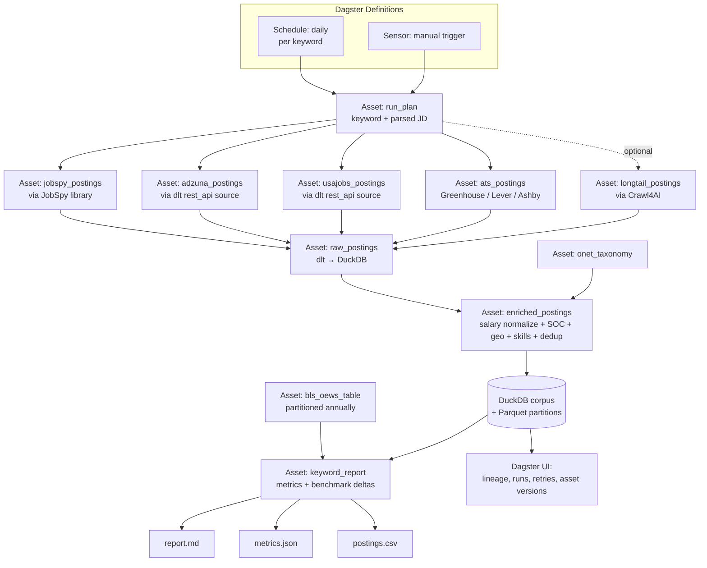
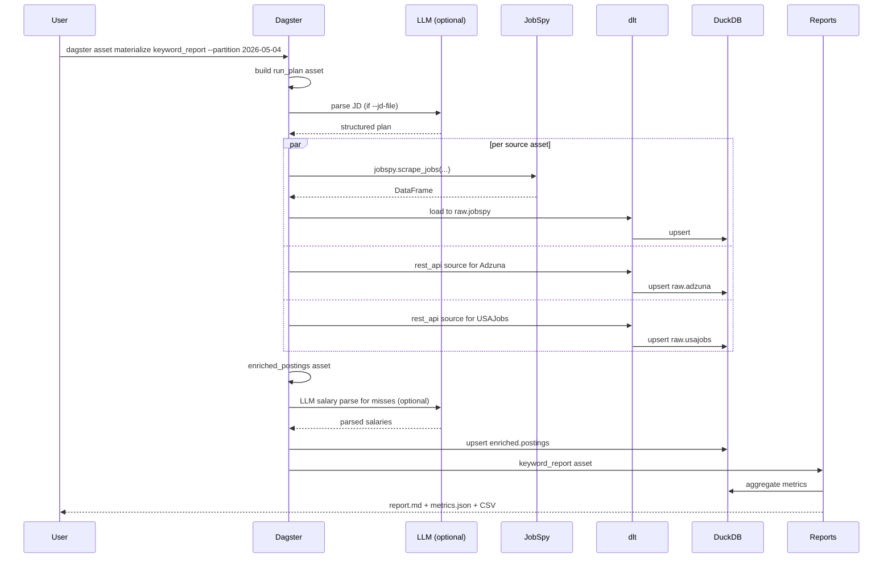
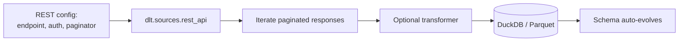
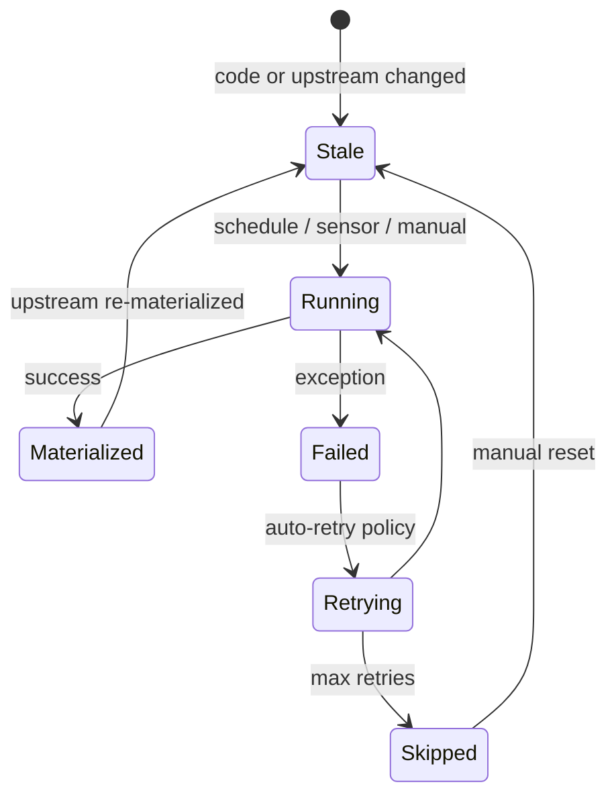
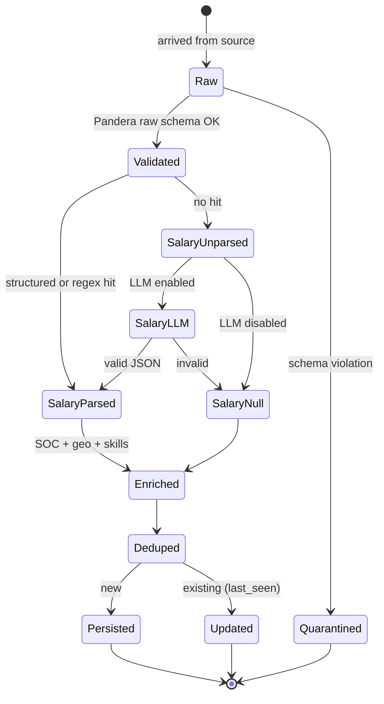
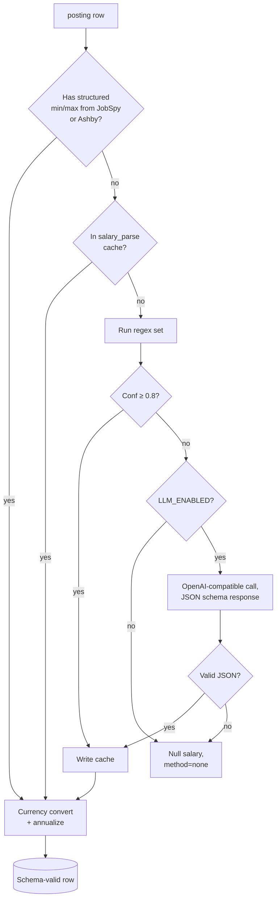

> **SUPERSEDED** — Archived 2026-05-11. This Dagster-centric, local-first specification has been replaced by a GitHub-Actions + Observable Framework architecture documented in the root `README.md` and `DECISIONS.md`. Kept for historical reference: it captures earlier scope decisions (JobSpy ingestion, BLS OEWS benchmarks, US focus, Dagster orchestration) that were intentionally rejected for the v1 portfolio build. See `DECISIONS.md` for the WHY.

---

# Job Market Intelligence Pipeline — Requirements & Build Plan 
**Document type:** Implementation specification for Claude Code
**Target executor:** Claude Code (agentic coding session)
**Owner:** Portfolio project
**Runtime target:** Local machine / Github Pages

---

## 0. What changed from v1


| v1 plan (build) | v2 plan (leverage) | Saved effort |
|---|---|---|
| 7 hand-rolled scrapers for major job boards | **JobSpy** library — one call, returns normalized DataFrame | ~2,000 LoC, ongoing maintenance |
| Hand-rolled ETL: raw → normalized → corpus, schema migrations | **dlt** (data load tool) — code-first ELT with auto schema evolution | ~800 LoC, schema migration logic |
| Custom run planner, dispatcher, retry/backoff, scheduling | **Dagster** — asset-centric orchestration with built-in scheduling, retries, observability | ~600 LoC, full ops UI for free |
| Hand-rolled DataFrame validation | **Pandera** — Pydantic-style schema validation for pandas/Polars | ~200 LoC |
| Custom HTML→structured extraction for long-tail career pages | **Crawl4AI** — open-source, LLM-friendly markdown crawler | ~400 LoC |
| FastFlowLM client, prompt mgmt, JSON-mode | **OpenAI-compatible client** + any provider (OpenAI, Anthropic, Ollama, vLLM, LM Studio) | model portability |

**Net effect:** the project shrinks from ~5,000 LoC of original code to ~800 LoC of glue code that wires these libraries together, while gaining a UI, lineage, schema evolution, and battle-tested scrapers.

---

## 1. Overview

Build an automated pipeline that, given a **keyword** or **job description text**, ingests matching job postings from multiple public sources, normalizes them into a single corpus, and emits salary/skill/demand analytics with BLS benchmark comparisons.

The pipeline:

- Runs entirely on the user's machine or github pages
- Uses no paid SaaS (every primary dependency is OSS or has a free tier sufficient for personal use)
- Produces a queryable corpus, a datbase file (DuckDB + Parquet)
- Produces per-run reports hostable on on GitHub Pages


To be decided:
- Objective is to run and host on github pages with an analytics page framework like Evidence (to be deciced on whith framewokr) or extract data and the unpload the static page dashboard. Whenever possible the entire ingestion pipeline should run on github pages or actions.
- Unsure about Dagster here if it aligns with the final solution
    - Schedules itself via Dagster's built-in scheduler (no extra cron/systemd plumbing required)

### 1.1 Primary outputs

1. **Persistent corpus** of normalized job postings (DuckDB + Parquet partitions).
2. **Per-keyword analytics** containing:
   - Salary distribution: `n`, `mean`, `median`, `p10`, `p25`, `p75`, `p90`, currency, period
   - Breakdown by metro, seniority level, remote/onsite
   - Skill frequency (top-N skills extracted from JD text)
   - Posting velocity (postings/day, rolling window)
   - Benchmark delta vs. BLS OEWS for the matched SOC code
3. **Dagster web UI** — run history, asset lineage, materialization status, retry controls.

### 1.2 Success criteria

- `dagster dev` brings up a working UI within 60 seconds of `pip install`.
- Materializing the `keyword_report` asset for a typical query completes in ≤ 10 minutes.
- ≥ 70% of postings have a parsed salary range (where source publishes salary at all).
- Pipeline runs entirely offline-friendly: only outbound HTTP is to the documented sources and (optionally) an LLM endpoint of the user's choosing.

---

## 2. Goals & Non-Goals

### 2.1 Goals

- **G1.** Maximum leverage: prefer a well-maintained library over hand-rolled code on every layer.
- **G2.** Asset-centric design: define the corpus and reports as Dagster software-defined assets so re-runs, partitioning, and lineage are free.
- **G3.** Pluggable LLM: any OpenAI-compatible endpoint works — the project never hard-depends on a specific model or runtime.
- **G4.** Reproducible: pinned `uv` lockfile; one container image runs everywhere.
- **G5.** Privacy-respecting by default: no telemetry, configurable proxies, no third-party analytics.

### 2.2 Non-Goals

- **NG1.** Real-time freshness (daily cadence is sufficient).
- **NG2.** Building scrapers for sources that JobSpy already covers — use it.
- **NG3.** Running our own orchestrator, scheduler, or web UI when Dagster ships them.
- **NG4.** Producing a multi-user service or web app.
- **NG5.** Targeting Tier-3 / aggressively-protected sources beyond what JobSpy already handles.

---

## 3. Glossary

| Term | Meaning |
|---|---|
| **Posting** | A single job listing as it appears on a source. |
| **Source** | A site or API that publishes postings. |
| **dlt source** | A `dlt`-decorated function that yields records; replaces our v1 "adapter." |
| **Asset** | A Dagster software-defined asset; a piece of data and the code that produces it. |
| **Run** | A Dagster materialization triggered by schedule, sensor, or manually. |
| **SOC code** | BLS Standard Occupational Classification (e.g. `15-1252` = Software Developer). |
| **OEWS** | BLS Occupational Employment and Wage Statistics — the benchmark dataset. |
| **JD** | Job description (free-text body of a posting). |
| **Corpus** | The persistent store of normalized postings across all runs. |

---

## 4. Library Choices and Rationale

### 4.1 The leveraged stack

All licenses verified against upstream sources (PyPI metadata, LICENSE files, and project websites) — see §23 for the full audit. Every entry below is OSI-approved permissive licensing usable for personal or commercial work.

| Layer | Library / package | PyPI install | License | Why it wins for this project |
|---|---|---|---|---|
| **Job-board scrapers** | **JobSpy** (speedyapply fork) | `python-jobspy` | MIT | Single library covering Indeed, LinkedIn, Glassdoor, Google, ZipRecruiter, Bayt, Naukri. Returns a normalized DataFrame with **already-parsed salary fields** (`min_amount`, `max_amount`, `currency`, `interval`, `salary_source`). Handles TLS impersonation, proxy rotation, and rate-limit edges. Active maintenance. |
| **ATS career pages** | direct HTTP via `httpx` | `httpx` | BSD-3-Clause | Greenhouse, Lever, Ashby expose trivial public JSON endpoints; no library needed. |
| **Long-tail/arbitrary pages** | **Crawl4AI** | `crawl4ai` | Apache-2.0 **with attribution clause** (v0.5.0+) | 58k+ GitHub stars, Playwright under the hood, outputs LLM-ready Markdown, supports both CSS selectors and LLM-based extraction. Local-first; no API keys required for the crawler itself. **Attribution requirement:** must include a "Powered by Crawl4AI" badge or text credit in `README.md` or `NOTICE.md`. See §23.2. |
| **ELT / pipeline primitive** | **dlt** (data load tool, core library) | `dlt` *(only — never `dlthub`)* | Apache-2.0 | Code-first, no infra. Wraps any Python iterable as a "source," handles schema inference, schema evolution, incremental loading, state, and load to DuckDB/Parquet. **Do not install the separate `dlthub` PyPI package** — it is proprietary and adds paid Pro/Scale/Enterprise features we do not need. See §4.2 and §23.2. |
| **Orchestration** | **Dagster** (open-source framework) | `dagster`, `dagster-webserver` | Apache-2.0 | Asset-centric model maps perfectly onto "produce a corpus, produce a report." First-class local dev (`dagster dev`), built-in UI, scheduler, sensors, retries, partitions, lineage. **We use the OSS framework only — not Dagster+ (paid cloud).** See §4.2. |
| **Storage / OLAP** | **DuckDB** + **Parquet** via **PyArrow** | `duckdb`, `pyarrow` | MIT / Apache-2.0 | Embedded analytical engine; queries Parquet in-place; zero-config. Polars and Pandas interop is zero-copy via Arrow. |
| **DataFrame engine** | **Polars** | `polars` | MIT | Lazy evaluation, columnar, multi-core by default. Used inside transforms; results land in DuckDB. |
| **Schema validation** | **Pandera** | `pandera` | MIT | Pydantic-style class schemas for DataFrames. Native pandas + Polars. Lightweight (~12 deps). |
| **Object validation** | **Pydantic v2** | `pydantic`, `pydantic-settings` | MIT | Inputs, configs, LLM JSON outputs, FastAPI-friendly if we ever expose one. |
| **HTTP (TLS-impersonating fallback)** | **curl_cffi** | `curl_cffi` | MIT | For the rare cases httpx isn't enough (most TLS work is handled inside JobSpy). |
| **Fuzzy match** | **rapidfuzz** | `rapidfuzz` | MIT | C-speed fuzzy matching for title→SOC. |
| **Dedup** | **datasketch** | `datasketch` | MIT | MinHash + LSH. |
| **LLM client** | **openai** (used as generic OpenAI-compatible client) | `openai` | Apache-2.0 | Works with OpenAI, Anthropic (via gateway), Ollama, vLLM, LM Studio, LiteLLM, etc. User chooses provider via env vars. |
| **CLI** | **typer** | `typer` | MIT | Annotated, ergonomic. Dagster has its own CLI; ours is thin. |
| **Tests** | **pytest** + **pytest-recording** (VCR) | `pytest`, `pytest-recording` | MIT | Fixture-replay; no live HTTP in CI. |
| **Lint/type** | **ruff** + **mypy** (strict) | `ruff`, `mypy` | MIT | Single linter; strict typing. |
| **Package manager** | **uv** | `uv` | MIT OR Apache-2.0 (dual) | Fast resolver, lockfile-first, replaces pip + pip-tools. |

### 4.2 What we explicitly do NOT add

| Not used | Why |
|---|---|
| `dlthub` PyPI package | **Proprietary**, not open-source. Adds paid Pro/Scale/Enterprise tier features (managed cloud runtime, workspace dashboards). The free `dlt` package covers every feature this spec requires. Treat `dlthub` as a hard exclusion — do not add it to `pyproject.toml` even transitively. |
| Dagster+ (Dagster Cloud) | Paid managed hosting + RBAC + audit logs. Not needed for a single-user self-hosted pipeline. We use only the Apache-2.0 OSS `dagster` and `dagster-webserver` packages. |
| Scrapy | JobSpy + Crawl4AI cover our scraping; Scrapy's middleware/scheduler model is overkill. |
| Airflow | Heavier ops, weaker local-dev story than Dagster for a solo project. |
| Prefect | Excellent tool, but Dagster's asset model is the better semantic fit for "produce a corpus." |
| Airbyte | Overkill (server, UI, Docker Compose) for ~10 sources we control. dlt is simpler and embeds in Dagster. |
| dbt | Optional later; for a single-user project, Dagster assets + DuckDB SQL is enough. |
| Great Expectations | Pandera covers our needs without the platform overhead. |
| Firecrawl / managed scraping | Paid SaaS; conflicts with self-hosted goal. Crawl4AI is the OSS substitute. |
| Selenium / Playwright (direct) | Crawl4AI wraps Playwright with sane defaults; no need to drive it ourselves. |

---

## 5. High-Level Architecture



The key shift from v1: **everything is a Dagster asset**. The corpus, the reports, even external reference data (BLS, O*NET) are assets with explicit dependencies, partitioning, and lineage tracked automatically.

---

## 6. Data Sources

### 6.1 Source register

| ID | Source(s) covered | Library / approach | Auth | Rate limit |
|---|---|---|---|---|
| `jobspy` | Indeed, LinkedIn, Glassdoor, Google, ZipRecruiter, Bayt, Naukri | **JobSpy** library | none (LinkedIn benefits from proxy) | per-board internal |
| `adzuna` | Adzuna aggregator | **dlt** `rest_api` source | App ID + key (free) | 50/day free tier |
| `usajobs` | US federal jobs | **dlt** `rest_api` source | User-Agent header | be polite |
| `ats` | Greenhouse, Lever, Ashby (per-company) | direct `httpx` calls | none | ~1 rps/company |
| `longtail` | Arbitrary career pages | **Crawl4AI** with LLM extraction | none | per-domain politeness |
| `bls_oews` | BLS occupational wages (benchmark, not postings) | **dlt** filesystem source | none | bulk download |
| `onet` | O*NET taxonomy | **dlt** filesystem source | none | bulk download |

### 6.2 JobSpy: what it gives us

JobSpy returns a pandas DataFrame with this schema (already normalized — we don't need to parse it):

```
title, company, company_url, job_url, location.{country,city,state},
is_remote, description, job_type, job_function.interval,
job_function.min_amount, job_function.max_amount, job_function.currency,
salary_source ('direct_data' | 'description'),
date_posted, emails,
# LinkedIn extras
job_level,
# LinkedIn + Indeed extras
company_industry,
# Indeed extras
company_country, company_employees_label, company_revenue_label, ...
```

This eliminates the entire v1 salary-parser fallback path for JobSpy sources. We still need the parser for `ats` and `longtail` sources whose salaries are embedded in JD text.

### 6.3 ATS endpoints (for direct httpx calls)

| ATS | Endpoint pattern | Returns |
|---|---|---|
| Greenhouse | `https://boards-api.greenhouse.io/v1/boards/{company}/jobs?content=true` | JSON, sometimes `pay_input_ranges` |
| Lever | `https://api.lever.co/v0/postings/{company}?mode=json` | JSON |
| Ashby | `https://api.ashbyhq.com/posting-api/job-board/{company}?includeCompensation=true` | JSON, often structured `compensationTierSummary` |

Companies tracked in `config/companies.yaml`. Adding a company is one line.

---

## 7. Functional Requirements

### 7.1 Inputs

- **FR-1** Accept input as `--keyword TEXT` or `--jd-file PATH`. Both produce a `RunPlan` Pydantic object.
- **FR-2** When `--jd-file` given, call the configured LLM endpoint with a structured-output prompt to extract `{title, level, skills[], location_pref, remote_pref, soc_hint}`. If no LLM is configured, fall back to keyword-only.
- **FR-3** Support `--country`, `--max-age-days`, `--sources` (subset of source IDs), `--results-per-source` (default 200).
- **FR-4** All inputs validated by a Pydantic model; invalid combos rejected before any HTTP.

### 7.2 Asset materialization

- **FR-5** Each source is a Dagster asset that depends on `run_plan`. Sources fail-isolated: one source's failure does not abort the run; downstream `raw_postings` consumes whichever sources succeeded.
- **FR-6** `jobspy_postings` calls `jobspy.scrape_jobs(...)` with parameters from `run_plan` and persists the returned DataFrame via dlt to `raw.jobspy`.
- **FR-7** `adzuna_postings`, `usajobs_postings` defined as **dlt `rest_api` sources** using dlt's declarative pagination/auth config; persisted to `raw.adzuna` / `raw.usajobs`.
- **FR-8** `ats_postings` iterates `companies.yaml`, fetches each board, and persists a flattened DataFrame to `raw.ats`.
- **FR-9** `longtail_postings` (optional) takes a list of arbitrary career-page URLs from config and uses Crawl4AI's `LLMExtractionStrategy` with our schema to extract postings.
- **FR-10** All raw assets are partitioned by date (Dagster `DailyPartitionsDefinition`); re-runs of a partition are idempotent via dlt's incremental load primitives.

### 7.3 Enrichment

- **FR-11** `enriched_postings` reads from `raw_postings`, applies in order:
  1. **Salary normalization** — for postings already structured (JobSpy, Ashby), map fields straight in. For unstructured (ATS without comp, longtail), run the regex parser; on miss, optionally call LLM (skipped if no LLM configured).
  2. **Currency conversion + annualization** — using ECB FX cache asset.
  3. **Title→SOC mapping** — rapidfuzz against the `onet_taxonomy` asset; threshold 70.
  4. **Geo resolution** — city/region/country → metro CBSA via the bundled lookup asset.
  5. **Skill extraction** — O*NET-bounded vocabulary (LLM augmentation optional).
  6. **Dedup** — MinHash on `normalize(title)+company+normalize(location)`; Jaccard ≥ 0.9 within 60 days = duplicate.
- **FR-12** Each enrichment step validated with a Pandera schema before passing to the next step.

### 7.4 Reporting

- **FR-13** `keyword_report` asset reads enriched data + BLS OEWS, produces:
  - `out/{run_id}/report.md` — human-readable
  - `out/{run_id}/metrics.json` — machine-readable
  - `out/{run_id}/postings.csv` — flattened sample
- **FR-14** Reports include the BLS OEWS comparison for the resolved SOC code at the matching metro level, with delta.
- **FR-15** Salary statistics computed only over postings where `salary_min IS NOT NULL`; reports include `n_with_salary / n_total`.

### 7.5 Scheduling

- **FR-16** Dagster `ScheduleDefinition` per keyword (declared in code or via dynamic partitions).
- **FR-17** A `manual_run` Dagster sensor allows triggering ad-hoc runs from the UI or via `dagster asset materialize`.
- **FR-18** No external cron/systemd glue — Dagster's scheduler is the source of truth.

---

## 8. Non-Functional Requirements

| ID | Requirement |
|---|---|
| **NFR-1** | A full default run completes in ≤ 10 minutes for a single keyword. |
| **NFR-2** | Per-process memory ceiling 2 GB. Use Polars lazy frames + dlt's streaming sources. |
| **NFR-3** | Disk: corpus ≤ 5 GB after 90 days × daily × 5 keywords. |
| **NFR-4** | All network egress configurable via `HTTPS_PROXY` env var. |
| **NFR-5** | Secrets only via env / `.env` (gitignored), surfaced through `pydantic-settings`. |
| **NFR-6** | Logs structured JSON via Dagster's logger; one event per line; no secrets/PII. |
| **NFR-7** | `ruff check` clean; `mypy --strict` exits 0; `pytest -x` passes. |
| **NFR-8** | One `Containerfile` produces a runnable image; works on Docker or Podman. |
| **NFR-9** | Reproducible: `uv.lock` committed. |
| **NFR-10** | The LLM is optional: every transformation has a non-LLM fallback path; pipeline runs end-to-end with `LLM_ENABLED=false`. |

---

## 9. Data Model

### 9.1 Pandera schema for `enriched_postings`

```python
import pandera.polars as pa
from pandera.typing.polars import Series

class PostingSchema(pa.DataFrameModel):
    id: Series[str] = pa.Field(unique=True)              # "{source}:{source_id}"
    source: Series[str] = pa.Field(isin=[...])
    source_url: Series[str] = pa.Field(nullable=True)
    title_raw: Series[str]
    title_norm: Series[str]
    level: Series[str] = pa.Field(isin=[
        "intern","junior","mid","senior","staff",
        "principal","manager","director","exec","unknown"
    ])
    company: Series[str] = pa.Field(nullable=True)
    company_norm: Series[str] = pa.Field(nullable=True)
    location_city: Series[str] = pa.Field(nullable=True)
    location_region: Series[str] = pa.Field(nullable=True)
    location_country: Series[str] = pa.Field(nullable=True)
    metro_cbsa: Series[str] = pa.Field(nullable=True)
    is_remote: Series[bool]
    soc_code: Series[str] = pa.Field(nullable=True)
    soc_title: Series[str] = pa.Field(nullable=True)
    soc_confidence: Series[str] = pa.Field(isin=["high","medium","low","none"])
    salary_min: Series[float] = pa.Field(nullable=True, ge=0)
    salary_max: Series[float] = pa.Field(nullable=True, ge=0)
    salary_currency_orig: Series[str] = pa.Field(nullable=True)
    salary_period_orig: Series[str] = pa.Field(
        nullable=True, isin=["hour","day","week","month","year"])
    salary_includes_equity: Series[bool] = pa.Field(nullable=True)
    salary_parse_method: Series[str] = pa.Field(
        isin=["structured","regex","llm","none"])
    salary_parse_confidence: Series[float] = pa.Field(ge=0, le=1)
    skills: Series[list[str]]
    posted_at: Series[pl.Datetime] = pa.Field(nullable=True)
    scraped_at: Series[pl.Datetime]
    jd_text: Series[str]
    jd_text_hash: Series[str]
    run_id: Series[str]

    class Config:
        strict = True
        coerce = True
```

**dlt** auto-creates the DuckDB tables from this. Schema evolution is handled automatically when fields change.

### 9.2 DuckDB layout

| Table | Purpose | Source |
|---|---|---|
| `raw.jobspy` | JobSpy DataFrame as-is | dlt resource |
| `raw.adzuna` / `raw.usajobs` | dlt rest_api outputs | dlt resource |
| `raw.ats` | Flattened Greenhouse/Lever/Ashby | dlt resource |
| `raw.longtail` | Crawl4AI extractions | dlt resource |
| `enriched.postings` | Validated, normalized | Dagster asset |
| `ref.soc_taxonomy` | O*NET data | Dagster asset |
| `ref.cbsa_lookup` | Metro lookup | bundled CSV |
| `ref.bls_oews` | BLS wage benchmarks | Dagster asset |
| `ref.fx_rates` | ECB rates, daily | Dagster asset |
| `cache.salary_parse` | Hash → parsed salary | DuckDB table |
| `system.runs` | Dagster auto-populates | Dagster |

---

## 10. Data Flow

### 10.1 End-to-end (Dagster materialization)



### 10.2 dlt source pattern (reused for adzuna, usajobs)



---

## 11. State Machines

### 11.1 Asset materialization (Dagster handles this)



### 11.2 Per-posting normalization



---

## 12. Module Specifications

### 12.1 Asset definitions

Each asset is a single decorated function. Dagster handles partitioning, caching, retries, and lineage.

```python
@dg.asset(partitions_def=daily)
def run_plan(context, keyword: str) -> RunPlan: ...

@dg.asset(partitions_def=daily, deps=[run_plan])
def jobspy_postings(context, run_plan: RunPlan) -> Output[pl.DataFrame]:
    df = jobspy.scrape_jobs(
        site_name=["indeed","linkedin","glassdoor","google","zip_recruiter"],
        search_term=run_plan.keyword,
        location=run_plan.location_pref,
        results_wanted=run_plan.results_per_source,
        country_indeed=run_plan.country,
        hours_old=24 * run_plan.max_age_days,
        proxies=settings.proxies,
    )
    return Output(pl.from_pandas(df), metadata={"rows": len(df)})

@dg.asset(deps=[run_plan])
def adzuna_postings(context, run_plan: RunPlan) -> ...:
    pipeline = dlt.pipeline(pipeline_name="adzuna", destination="duckdb",
                            dataset_name="raw")
    pipeline.run(adzuna_rest_source(run_plan), table_name="adzuna")

# ...similar for usajobs, ats, longtail
```

### 12.2 Module surface

| File | Purpose | Approx LoC |
|---|---|---|
| `defs/__init__.py` | Dagster `Definitions` object exporting all assets, schedules, sensors, resources | 50 |
| `defs/sources/jobspy_assets.py` | JobSpy-backed assets | 60 |
| `defs/sources/adzuna.py` | dlt rest_api config + asset | 80 |
| `defs/sources/usajobs.py` | dlt rest_api config + asset | 70 |
| `defs/sources/ats.py` | Greenhouse/Lever/Ashby asset | 120 |
| `defs/sources/longtail.py` | Crawl4AI asset (optional) | 100 |
| `defs/refs/bls_oews.py` | BLS bulk loader asset | 90 |
| `defs/refs/onet.py` | O*NET loader asset | 70 |
| `defs/refs/fx_rates.py` | ECB FX cache asset | 50 |
| `defs/enrich/salary.py` | Regex parser + LLM fallback | 180 |
| `defs/enrich/taxonomy.py` | rapidfuzz title→SOC | 60 |
| `defs/enrich/geo.py` | location → CBSA | 40 |
| `defs/enrich/skills.py` | skill extraction | 60 |
| `defs/enrich/dedup.py` | MinHash dedup | 50 |
| `defs/enrich/postings.py` | composes all enrichers into `enriched_postings` asset | 80 |
| `defs/report/keyword_report.py` | metrics + Markdown rendering | 150 |
| `defs/resources.py` | Dagster resources: dlt pipeline, LLM client, DuckDB conn | 70 |
| `cli.py` | Thin Typer wrapper around `dagster asset materialize` | 50 |

**Total: ~1,400 LoC** (vs ~5,000 in v1's hand-rolled plan).

### 12.3 Salary parser (the only non-trivial enricher)



Regex set and fixture table identical to v1 §12.

LLM client: a thin `LLMClient` class wrapping the `openai` Python SDK with `base_url` and `api_key` from settings. Works with any OpenAI-compatible endpoint.

---

## 13. Anti-Detection Strategy

Most of v1's anti-detection requirements collapse into "use the libraries' built-in protections":

| Concern | v1 solution | v2 solution |
|---|---|---|
| TLS fingerprint on Indeed/LinkedIn | hand-rolled curl_cffi profile ladder | JobSpy's bundled `tls-client` |
| Rate limiting | hand-rolled aiolimiter | JobSpy's internal + per-asset cooldown in Dagster |
| Proxy rotation | hand-rolled | JobSpy's `proxies=[...]` round-robin |
| robots.txt | hand-rolled checker | Crawl4AI respects it; ATS endpoints are explicitly public |
| User-Agent / JA4 consistency | hand-rolled | Library defaults |
| Retries with backoff | hand-rolled | Dagster `RetryPolicy` per asset |

Configuration surfaces exposed:
- `JOBSPY_PROXIES` — comma-separated `user:pass@host:port` list.
- `HTTPS_PROXY` — applied to httpx + dlt + Crawl4AI.
- `LONGTAIL_USER_AGENT` — UA for Crawl4AI (it sets a sensible default).

---

## 14. Configuration Surface

### 14.1 Environment variables

| Var | Default | Purpose |
|---|---|---|
| `JOBPIPE_DATA_DIR` | `./data` | corpus + raw root |
| `JOBPIPE_OUT_DIR` | `./out` | reports |
| `DAGSTER_HOME` | `./.dagster` | Dagster instance state |
| `ADZUNA_APP_ID` / `ADZUNA_APP_KEY` | — | required for Adzuna |
| `USAJOBS_USER_AGENT` | — | required, e.g. `jobpipe/0.1 (you@example.com)` |
| `JOBSPY_PROXIES` | — | optional comma list |
| `HTTPS_PROXY` | — | optional proxy |
| `LLM_ENABLED` | `false` | turn LLM enrichment on/off |
| `LLM_BASE_URL` | — | any OpenAI-compatible endpoint |
| `LLM_API_KEY` | — | matching key (or `sk-anything` for local servers) |
| `LLM_MODEL` | — | e.g. `gpt-4o-mini`, `claude-3-5-haiku-latest`, `qwen2.5:7b` |

### 14.2 `companies.yaml`

```yaml
greenhouse:
  - airbnb
  - stripe
  - figma
lever:
  - netflix
  - shopify
ashby:
  - linear
  - vercel
```

### 14.3 `longtail.yaml` (optional)

```yaml
- name: ExampleCo
  url: https://example.com/careers
  selector_hint: "div.job-list"     # optional CSS hint for Crawl4AI
```

---

## 15. Directory Structure

```
jobpipe/
├── Containerfile                  # Docker/Podman compatible
├── compose.yaml
├── pyproject.toml
├── uv.lock
├── README.md                      # MUST include Crawl4AI attribution (§23.2)
├── NOTICE.md                      # upstream attributions (Crawl4AI badge + acks)
├── LICENSES/                      # vendored copies of third-party LICENSE files
│   ├── crawl4ai-LICENSE.txt
│   ├── jobspy-LICENSE.txt
│   ├── dlt-LICENSE.txt
│   ├── dagster-LICENSE.txt
│   └── ...                        # populated by `uv pip licenses` or similar
├── .env.example
├── .gitignore
├── config/
│   ├── companies.yaml
│   ├── longtail.yaml
│   └── keywords.yaml              # for scheduled runs
├── src/jobpipe/
│   ├── __init__.py
│   ├── settings.py                # pydantic-settings
│   ├── cli.py                     # Typer
│   ├── llm.py                     # OpenAI-compatible client
│   ├── schemas.py                 # Pandera + Pydantic
│   ├── defs/
│   │   ├── __init__.py            # Dagster Definitions object
│   │   ├── resources.py
│   │   ├── partitions.py
│   │   ├── sources/
│   │   │   ├── jobspy_assets.py
│   │   │   ├── adzuna.py
│   │   │   ├── usajobs.py
│   │   │   ├── ats.py
│   │   │   └── longtail.py
│   │   ├── refs/
│   │   │   ├── bls_oews.py
│   │   │   ├── onet.py
│   │   │   └── fx_rates.py
│   │   ├── enrich/
│   │   │   ├── salary.py
│   │   │   ├── taxonomy.py
│   │   │   ├── geo.py
│   │   │   ├── skills.py
│   │   │   ├── dedup.py
│   │   │   └── postings.py
│   │   ├── report/
│   │   │   └── keyword_report.py
│   │   └── schedules.py
├── tests/
│   ├── conftest.py                # VCR fixtures, fake LLM
│   ├── fixtures/
│   ├── test_salary.py
│   ├── test_taxonomy.py
│   ├── test_dedup.py
│   ├── test_assets.py             # Dagster asset materialization tests
│   ├── test_e2e.py
│   └── test_license_audit.py      # verifies attribution + excluded deps
└── data/                          # gitignored
    ├── corpus.duckdb
    └── parquet/
```

---

## 16. Implementation Phases

| Phase | Deliverable | Acceptance |
|-------|-------------|---|
| **P0 — Skeleton** | Repo, `Definitions` object with one trivial asset, `dagster dev` works, settings load from `.env`, DuckDB resource. | `dagster dev` launches; UI shows one asset; `pytest` passes empty suite. |
| **P1 — JobSpy + dlt + DuckDB** | `run_plan` + `jobspy_postings` + `raw_postings` assets. Materialize with `--keyword "data engineer"` and write to DuckDB via dlt. | DuckDB table populated; Dagster UI shows lineage; ≥ 100 rows fetched. |
| **P2 — Pandera-validated enrichment** | `enriched_postings` asset with structured-salary path only (no regex/LLM yet) + dedup + Pandera validation. | Pandera schema enforces; assets re-runnable; dedup reduces re-run row count. |
| **P3 — Reference data + benchmarks** | `bls_oews`, `onet`, `fx_rates` reference assets. Title→SOC mapping, geo CBSA mapping. | Reports include SOC code and BLS wage delta. |
| **P4 — Reporter** | `keyword_report` asset emits Markdown + JSON + CSV. | Run produces non-empty report files with all §1.1.2 metrics. |
| **P5 — Adzuna + USAJobs via dlt rest_api** | dlt `rest_api` source configs + matching assets. | Assets materialize; rows visible in `raw.adzuna`/`raw.usajobs`. |
| **P6 — ATS sources** | `ats_postings` asset for Greenhouse, Lever, Ashby; companies.yaml. | Adding a company is config-only; asset re-materializes. |
| **P7 — Salary regex + LLM fallback** | Salary parser with regex set, LLM fallback gated on `LLM_ENABLED`. | Fixture-based tests pass; salary coverage ≥ 70% on a 100-posting fixture. |
| **P8 — Crawl4AI longtail (optional)** | `longtail_postings` asset using Crawl4AI's LLM extraction. | One demo URL extracts a posting end-to-end. |
| **P9 — Schedules + container** | Daily Dagster schedule per keyword in `keywords.yaml`; Containerfile. | Schedule fires; `podman build` produces a working image; `compose.yaml` runs Dagster + worker. |
| **P10 — Hardening** | mypy strict, ≥ 80% coverage, README, CI config. | All gates green. |

Each phase ends with: tests green, `ruff check` clean, README section updated, CHANGELOG entry.

---

## 17. Testing Requirements

| ID | Requirement |
|---|---|
| **T-1** | All HTTP-based assets tested with `pytest-recording` cassettes; no live HTTP in CI. |
| **T-2** | Dagster assets tested via `materialize_to_memory` with mocked resources. |
| **T-3** | Salary parser fixture table from v1 §12.2 must pass. |
| **T-4** | Pandera schema enforced in tests (negative cases for each constraint). |
| **T-5** | Dedup test: feed duplicates, assert second is dropped; near-dup with Jaccard 0.85 retained, 0.95 dropped. |
| **T-6** | LLM client tests use a fake server (`pytest-httpserver`); no real LLM calls. |
| **T-7** | E2E: `materialize_to_memory(keyword_report)` produces a report file with expected structure. |
| **T-8** | Coverage gate: 80% lines, 70% branches. |

---

## 18. Deployment

### 18.1 Local

```
uv venv && source .venv/bin/activate
uv pip sync uv.lock
cp .env.example .env  # fill in ADZUNA_*, USAJOBS_USER_AGENT
dagster dev
```

The Dagster UI at `http://localhost:3000` shows assets, schedules, runs.

### 18.2 Container

`Containerfile`:
- Base: `python:3.12-slim`
- Install `uv`, copy `uv.lock`, `uv pip sync --system`
- Run as non-root user
- `CMD ["dagster", "dev", "-h", "0.0.0.0"]` for local dev image, or `dagster-webserver` + `dagster-daemon` for prod-like.

`compose.yaml` (works with Podman or Docker Compose):

| Service | Image | Purpose |
|---|---|---|
| `webserver` | `localhost/jobpipe:latest` | `dagster-webserver` on :3000 |
| `daemon` | `localhost/jobpipe:latest` | `dagster-daemon run` (schedules/sensors) |
| `pipeline` | shared volume | code location reload |

Schedules run via the daemon. No systemd/cron required.

### 18.3 Schedule example

```python
@dg.schedule(cron_schedule="0 6 * * *", target=keyword_report)
def daily_data_engineer():
    return RunRequest(partition_key=date.today().isoformat(),
                      run_config={"keyword": "data engineer"})
```

---

## 19. Observability

Dagster gives most of this for free:

- **Runs UI** — every materialization, status, duration, retries.
- **Asset lineage** — visual graph of which asset depends on what.
- **Asset versioning** — code version + data version per materialization.
- **Per-asset metadata** — emit `Output(value, metadata={"rows": N, "salary_coverage": 0.74})` and Dagster shows it.
- **Structured logs** — `context.log.info(...)` in JSON format.

We add only: a `run_summary.json` written by the report asset for downstream tooling.

---

## 20. Acceptance Criteria

The project is complete when **all** of the following hold:

1. `git clone && cp .env.example .env && uv sync && pytest` passes.
2. `dagster dev` launches and shows the asset graph.
3. Materializing `keyword_report` for `"data engineer"` produces a non-empty `report.md` with at least 5 of: median salary, p25/p75, BLS delta, top-10 skills, posting count, source breakdown, location histogram, level histogram.
4. Re-materializing the same partition twice persists no duplicate rows.
5. `mypy --strict src/jobpipe` exits 0.
6. Daily schedule materializes successfully on the daemon.
7. Pipeline materializes end-to-end with `LLM_ENABLED=false` (no LLM dependency).
8. Pipeline materializes end-to-end with any OpenAI-compatible `LLM_BASE_URL` (provider portability test).
9. README documents: setup, env vars, all CLI commands, how to add a new ATS company, how to add a new dlt source, legal/ethical notes.
10. `podman build` (or `docker build`) succeeds; container runs `dagster dev`.
11. **License compliance** (see §23):
    a. `README.md` (or `NOTICE.md`) contains a "Powered by Crawl4AI" badge or equivalent text credit.
    b. `LICENSES/` directory contains a copy of every third-party LICENSE for the libraries in §4.1.
    c. `tests/test_license_audit.py` passes: it inspects `uv.lock` (or `pip list`) and asserts that the `dlthub` package is **not** installed (only `dlt`), and that no `dagster-cloud` package is installed.

---

## 21. Open Questions / Decisions Deferred

| # | Question | Default if unanswered |
|---|---|---|
| Q1 | Multi-country support? | US-only at P1; multi-country via JobSpy params + Adzuna country code at P5. |
| Q2 | Keep raw `jd_text` in corpus? | Yes locally; never export. |
| Q3 | Add a vector index over JD text for semantic search? | Out of scope for v1. |
| Q4 | Add dbt for SQL transforms? | Optional later phase; Dagster + DuckDB SQL is sufficient now. |
| Q5 | Add a Streamlit dashboard? | Not needed — Dagster's UI covers operational visibility; reports cover analytical visibility. |
| Q6 | Use `dagster-dlt` integration package or call dlt directly inside assets? | Start with direct calls; switch to `dagster-dlt` if its features (auto-materialization on schema change) become useful. |

---

## 22. Notes for the Implementing Agent

- **Build phase by phase.** Each phase has its own acceptance gate; verify before moving on.
- **Use library defaults aggressively.** Do not configure JobSpy beyond what's necessary; do not bypass dlt's schema inference; do not write your own retry logic when Dagster's `RetryPolicy` exists.
- **One PR per phase.** Each PR includes: code, tests, README delta, CHANGELOG entry.
- **Fixtures first.** When integrating a new HTTP source, record a VCR cassette before writing the parser. Test against the fixture, not live HTTP.
- **No new top-level dependencies without one-line justification** in the PR description.
- **Pin exact dependencies in `uv.lock`.** Never use `~=` or `>=` for the libraries in §4.1; lock to known-good versions and bump deliberately.
- **Never install `dlthub` or `dagster-cloud`.** These are the proprietary companion packages of `dlt` and Dagster respectively. The OSS spec uses only `dlt`, `dagster`, and `dagster-webserver`. The `test_license_audit.py` check in §20 enforces this.
- **Crawl4AI attribution is non-optional.** v0.5.0+ ships under Apache-2.0 with an attribution clause. Add the badge to `README.md` in the same PR that introduces the `crawl4ai` dependency. If skipped, remove `crawl4ai` from `pyproject.toml` and the `longtail_postings` asset.
- **Surface failure loudly.** A run with 0 fetched postings should fail the `raw_postings` asset, not silently produce an empty report.
- **Keep enrich/ pure.** All side effects (HTTP, FS, DB) live in `defs/sources/*` and Dagster resources. The enrich modules take DataFrames in, return DataFrames out.
- **The LLM is a resource, not a hard dep.** Every enrichment must work with `LLM_ENABLED=false`. The LLM only fills gaps the deterministic path can't.
- **Don't fight the libraries.** If a library's design pushes back on a v2 requirement, surface it as an open question rather than working around the library.

---

## 23. License Audit (Appendix)

This appendix records the upstream license for every library in §4.1, verified against the project's own documentation, PyPI metadata, or `LICENSE` file in the source repository.

### 23.1 Verified license table

| Package (PyPI name) | Version policy | License | Source verified | Notes |
|---|---|---|---|---|
| `python-jobspy` | pin latest minor | MIT | speedyapply/JobSpy docs + `LICENSE` | — |
| `dlt` | pin latest minor | Apache-2.0 | dltHub website ("dlt is Apache 2.0 licensed and always free to use") + PyPI metadata | **Do not install `dlthub` package** — proprietary. |
| `dagster`, `dagster-webserver` | pin latest minor | Apache-2.0 | PyPI metadata + `dagster-io/dagster` repo | **Do not install `dagster-cloud`** — proprietary. |
| `crawl4ai` | pin latest minor | Apache-2.0 **+ attribution clause (v0.5.0+)** | `unclecode/crawl4ai` `LICENSE` + `CHANGELOG.md` | Attribution badge required in `README.md` or `NOTICE.md`. See §23.2. |
| `duckdb` | pin latest minor | MIT | duckdb.org + PyPI | — |
| `polars` | pin latest minor | MIT | pola.rs + PyPI | — |
| `pyarrow` | pin latest minor | Apache-2.0 | Apache Arrow project | — |
| `pandera` | pin latest minor | MIT | pandera.readthedocs.io + PyPI | — |
| `pydantic`, `pydantic-settings` | pin latest minor | MIT | pydantic.dev + PyPI | — |
| `httpx` | pin latest minor | BSD-3-Clause | python-httpx.org + PyPI | — |
| `curl_cffi` | pin latest minor | MIT | PyPI metadata | — |
| `rapidfuzz` | pin latest minor | MIT | PyPI metadata | — |
| `datasketch` | pin latest minor | MIT | PyPI metadata | — |
| `openai` (SDK) | pin latest minor | Apache-2.0 | openai/openai-python `LICENSE` | Used as generic OpenAI-compatible client. |
| `typer` | pin latest minor | MIT | typer.tiangolo.com + PyPI | — |
| `pytest`, `pytest-recording` | pin latest minor | MIT | PyPI metadata | — |
| `ruff` | pin latest minor | MIT | astral.sh/ruff | — |
| `mypy` | pin latest minor | MIT | mypy.readthedocs.io | — |
| `uv` | pin latest minor | MIT OR Apache-2.0 (dual) | astral.sh/uv | — |

All licenses are OSI-approved permissive. There are no copyleft (GPL/AGPL/LGPL) dependencies. Commercial use, modification, and private redistribution are all permitted without payment.

### 23.2 Crawl4AI attribution compliance

Crawl4AI v0.5.0+ adds an attribution clause to its Apache-2.0 license. To comply, **one of** the following must appear in `README.md` or `NOTICE.md`:

**Option A — Badge (recommended):**

```markdown
[](https://github.com/unclecode/crawl4ai)
```

**Option B — Text credit:**

```markdown
This project uses [Crawl4AI](https://github.com/unclecode/crawl4ai) (Apache-2.0)
for long-tail web extraction.
```

If `crawl4ai` is removed from `pyproject.toml` (i.e. the optional P8 phase is not implemented), this requirement does not apply.

### 23.3 Proprietary companion packages — explicitly excluded

The following PyPI packages are **proprietary** companions of free OSS projects and must NOT be installed:

| Package | Companion of | Why excluded |
|---|---|---|
| `dlthub` | `dlt` | Adds Pro/Scale/Enterprise paid features (managed runtime, dashboards). Free `dlt` covers our needs. |
| `dagster-cloud` | `dagster` | Adds Dagster+ integration (paid hosted control plane). We self-host. |

The test `tests/test_license_audit.py` enforces both exclusions by inspecting the installed package set and failing if either appears.

### 23.4 Data source terms (not OSS, separate from library licensing)

The pipeline consumes several free public APIs / datasets. These are governed by terms of service, not OSS licenses. Documented here for completeness:

| Source | Cost | Governing terms |
|---|---|---|
| Adzuna API | Free | ~50 calls/day on personal tier; non-commercial use. Requires App ID + Key registration. |
| USAJobs API | Free | Requires `User-Agent` header with email. US federal government, public domain content. |
| BLS OEWS | Free | US government, public domain. |
| O*NET database | Free | US Dept of Labor; data is CC BY 4.0. |
| Greenhouse / Lever / Ashby public board endpoints | Free | Unauthenticated public endpoints. No formal license; conventionally permitted for read-only aggregation. |

Per the project's stated scope (single-user, personal, non-commercial), all of the above are within their respective terms.