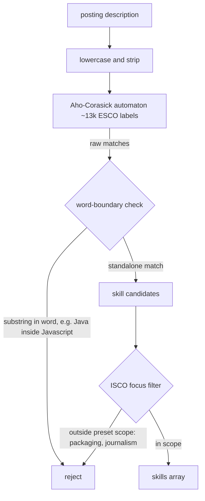

# Methodology & Docs

How the data gets here, how the taggers work, and the architecture decisions that shaped it.

## End-to-end data flow

From Adzuna's API to your browser, no backend:

```mermaid
flowchart LR
  A[Adzuna API] -->|JSON pages| B[ingest adapter]
  B -->|raw rows| C[normalise.run PostingSchema v3 incl work_arrangement tagger]
  C -->|EUR-normalised salaries| D[isco_tagger rapidfuzz cutoff 85]
  D -->|plus isco_code| E[skills_tagger ESCO Pillar B Aho-Corasick]
  E -->|plus skills| F[(parquet flat layout)]
  F -->|gh release upload| G[GitHub Releases latest preset parquet]
  G -->|FileAttachment| H[DuckDB-WASM browser]
  H --> I[Observable Plot]
```



A weekly cron in GitHub Actions runs the pipeline; the dashboard is rebuilt and pushed to GitHub Pages by `deploy-pages`. No server, no API key in the browser.

The dashboard itself is seven pages (Overview, Geography, Work Arrangement, Skills &amp; Roles, Compare Periods, Quality &amp; Coverage, and this one). Every data page shares the same sticky filter card — preset, country, ISCO group, work arrangement, salary range, date range — persisted in the URL so selections carry across pages, and ends with a filtered-postings table with one-click CSV export of the current selection. Compare Periods is the exception: it replaces the shared filter card with its own two period selectors, since its charts contrast two time slices rather than one filtered view.

## ESCO skills tagger

Free-text job descriptions are scanned for skills using an Aho-Corasick automaton built from the ESCO Pillar B vocabulary, then scoped to the preset's ISCO focus:



The word-boundary check fixes a known substring-match pitfall (e.g. `Java` matches inside `Javascript`). The ISCO-focus filter is what makes the tagger preset-aware — the same automaton serves all presets, but each preset's YAML `isco_focus` narrows the output to relevant skills.

## Preset YAML schema

A preset is the unit of pluggability. Anyone who forks the repo can define their own; the existing one is for EU data-analyst roles:

```yaml
# config/runs/data_analyst_eu.yaml (abridged)
preset_id: data_analyst_eu
isco_focus:            # scopes the ESCO skills tagger to the analytics family
  - "2511"  # Systems analysts
  - "2519"  # Software & applications developers/analysts NEC
  - "2521"  # Database designers and administrators
  - "2529"  # Database and network professionals NEC
  - "2421"  # Management and organization analysts
  - "2120"  # Mathematicians, actuaries and statisticians
  - "1330"  # ICT service managers
sources:
  adzuna:
    enabled: true
    countries: ["gb", "es"]   # active pair; 7-country EU expansion planned
    keywords: ["data analyst", "analytics engineer", "bi analyst"]
publish:
  accumulate_window_days: 180
```

Fork-friendly by design — to spin up a `data_engineer_us` preset you copy the YAML, adjust queries + countries + `isco_focus`, and the cron will pick it up.

## Architecture decisions

Decision log lives at [`DECISIONS.md`](https://github.com/alex-wu/jobmarket_analyzer/blob/main/DECISIONS.md). One ADR per significant choice:

<div class="card">

| ADR | Title |
|---|---|
| 001 | Orchestration: GitHub Actions cron (not Dagster) |
| 002 | Frontend: Observable Framework (not Evidence.dev, not Streamlit) |
| 003 | Ingestion: API-first, no JobSpy |
| 004 | Storage + delivery: Parquet via GitHub Releases as CDN |
| 005 | Licence: Apache-2.0 |
| 006 | Occupation taxonomy: ESCO (ISCO-08), not O*NET/SOC |
| 007 | LLM optional, openai-compatible |
| 008 | Pluggable adapter pattern (sources + benchmarks) |
| 009 | Remotive excluded from ingest sources |
| 010 | ESCO label snapshot built by walking the ISCO concept tree |
| 011 | OECD SDMX adapter ships disabled (Cloudflare) |
| 012 | CSO PxStat 4-digit ISCO coarseness |
| 013 | HN Algolia + LLM client descoped from v1 |
| 014 | Local-only files excluded from the public repo |
| 015 | httpx credential redaction filter |
| 016 | GitHub Pages deploy via `actions/deploy-pages` |
| 017 | Scope cut to Adzuna-only post-v1 stabilisation |
| 018 | Weekly cadence + multi-country single-run |
| 019 | Multi-preset `latest-{preset_id}` release naming |
| 020 | Accumulated dataset via pure-function recompute |
| 021 | No per-country keyword translation table in v1 |
| 022 | PostingSchema v2 — persist 5 Adzuna fields + skills |
| 023 | Skill enrichment via ESCO Pillar B + Aho-Corasick |
| 024 | Filter state persistence via URL search params |
| 025 | PostingSchema v3 — work_arrangement, dead-weight column drop |
| 026 | Dashboard v2 — Europe choropleth, page consolidation, CSV export |

</div>

## Data gaps (deliberate)

The original spec called for `experience_level`, `work_arrangement`, and detailed `skills` extraction. Two of the three have shipped: `work_arrangement` (remote / hybrid / onsite) is inferred by a multilingual keyword tagger (ADR-025) and has its own page plus a global filter — with the dominant unclassified share shown honestly as <code>unknown</code>; ESCO `skills` (ADR-023) are surfaced as the top-skills chart on Skills &amp; Roles. Only `experience_level` remains unfilled — Adzuna's payload doesn't carry it, and we ship only fields we have rather than guessing.

## Why the data re-loads on every page

Observable Framework uses standard `<a href>` navigation, not SPA routing — clicking a sidebar link is a full HTTP page load. Each navigation creates a fresh DuckDB-WASM client and re-attaches the parquet. In practice this is cheap on revisits: the browser HTTP-caches the `.wasm` runtime and the `.parquet` file, and modern Chromium and Firefox cache compiled WebAssembly per-origin. First page hit pays the parse cost; subsequent pages (and refreshes) hit warm caches.

There is no in-memory hand-off between pages. SPA routing was considered and rejected — it would mean abandoning Framework's documented routing model. Filter state IS preserved across navigation via URL search params — see the address bar after touching any filter.

The dashboard uses `DuckDBClient.of({postings: FileAttachment(...)})` in JS cells rather than Framework's frontmatter `sql:` registration + fenced ` ```sql id= ``` ` blocks. Both are canonical patterns per the Observable docs; we use `DuckDBClient` because our chart queries compose WHERE clauses from filter state in JS (e.g. `${andClause(where)}`), and fenced `sql id=` blocks parameter-bind `${...}` interpolations rather than text-substituting them — a SQL-injection safety feature that doesn't fit dynamic SQL-fragment composition. Per the Observable docs: "DuckDBClient is required if you need greater control, including dynamic table registration."

The Edge-on-Windows `TProtocolException` is upstream <a href="https://github.com/duckdb/duckdb-wasm/issues/1658" target="_blank" rel="noopener">duckdb-wasm bug #1658</a> (open since 2024-03-04); migrating between the two patterns does not fix it. See the troubleshooting note below.

## Troubleshooting

**`Error: Invalid Error: TProtocolException: Invalid data`** in the browser — this is client-side cache state in Chromium-based browsers (Chrome/Edge) on Windows, not a data-writer bug: upstream <a href="https://github.com/duckdb/duckdb-wasm/issues/1658" target="_blank" rel="noopener">duckdb-wasm #1658</a>, open since 2024-03-04. Firefox is unaffected — it is the recommended browser for this dashboard. Headless smoke tests and desktop DuckDB read the same parquet cleanly. Fix:

1. Use Firefox — the bug does not reproduce there.
2. In Chrome/Edge: hard-refresh the page (`Ctrl+Shift+R` / `Cmd+Shift+R`).
3. If it persists: DevTools → Application → Storage → "Clear site data".
4. Reload.

Do not modify the data pipeline to "fix" this — the writer is innocent.

## Tech stack

Observable Framework (shell + reactive runtime) · DuckDB-WASM (in-browser SQL on the parquet) · Observable Plot (charts, stock marks only) · Pandera strict-mode (upstream `PostingSchema` validation) · GitHub Actions (weekly cron + pages deploy) · `@duckdb/node-api` (build-time loader transform).

## Refresh the local sample

```bash
gh release download latest \
  -p "latest-data_analyst_eu.parquet" -p "manifest.json" \
  -R alex-wu/jobmarket_analyzer \
  -D data/gh_databuild_samples/ --clobber
```
