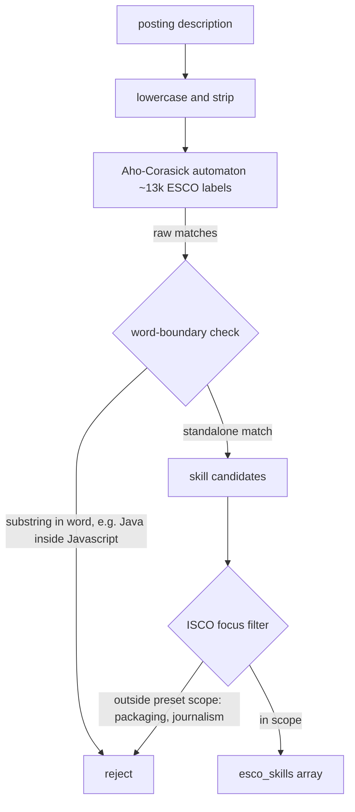

# Methodology & Docs

How the data gets here, how the taggers work, and the architecture decisions that shaped it.

## End-to-end data flow

From Adzuna's API to your browser, no backend:

```mermaid
flowchart LR
  A[Adzuna API] -->|JSON pages| B[ingest adapter]
  B -->|raw rows| C[normalise.run plus PostingSchema v2]
  C -->|EUR-normalised salaries| D[isco_tagger rapidfuzz cutoff 85]
  D -->|plus isco_code| E[skills_tagger ESCO Pillar B Aho-Corasick]
  E -->|plus esco_skills| F[(parquet flat layout)]
  F -->|gh release upload| G[GitHub Releases latest preset parquet]
  G -->|FileAttachment| H[DuckDB-WASM browser]
  H --> I[Observable Plot]
```



A weekly cron in GitHub Actions runs the pipeline; the dashboard is rebuilt and pushed to GitHub Pages by `deploy-pages`. No server, no API key in the browser.

## ESCO skills tagger

Free-text job descriptions are scanned for skills using an Aho-Corasick automaton built from the ESCO Pillar B vocabulary, then scoped to the preset's ISCO focus:



The word-boundary check fixes a known substring-match pitfall (e.g. `Java` matches inside `Javascript`). The ISCO-focus filter is what makes the tagger preset-aware — the same automaton serves all presets, but each preset's YAML `isco_focus` narrows the output to relevant skills.

## Preset YAML schema

A preset is the unit of pluggability. Anyone who forks the repo can define their own; the existing one is for EU data-analyst roles:

```yaml
# presets/data_analyst_eu.yml
id: data_analyst_eu
adzuna:
  queries: [data analyst, data scientist]
  countries: [gb, es, de, fr, ie, nl]
  results_per_page: 50
  max_pages: 4
isco_focus:
  - "2511"  # Systems analysts
  - "2521"  # Database designers and administrators
  - "2529"  # Database/network professionals not elsewhere classified
  - "3313"  # Accounting associate professionals (analyst overlap)
schedule:
  cron: "0 6 * * 1"  # weekly Mondays 06:00 UTC
```

Fork-friendly by design — to spin up a `data_engineer_us` preset you copy the YAML, adjust queries + countries + `isco_focus`, and the cron will pick it up.

## Architecture decisions

Decision log lives at [`DECISIONS.md`](https://github.com/alex-wu/jobmarket_analyzer/blob/main/DECISIONS.md). One ADR per significant choice:

<div class="card">

| ADR | Title |
|---|---|
| 001 | Orchestration: GitHub Actions cron (not Dagster) |
| 002 | Frontend: Observable Framework (not Evidence.dev, not Streamlit) |
| 003 | Ingestion: API-first, no JobSpy |
| 004 | Storage + delivery: Parquet via GitHub Releases as CDN |
| 005 | Licence: Apache-2.0 |
| 006 | Occupation taxonomy: ESCO (ISCO-08), not O*NET/SOC |
| 007 | LLM optional, openai-compatible |
| 008 | Pluggable adapter pattern (sources + benchmarks) |
| 009 | Remotive excluded from ingest sources |
| 010 | ESCO label snapshot built by walking the ISCO concept tree |
| 011 | OECD SDMX adapter ships disabled (Cloudflare) |
| 012 | CSO PxStat 4-digit ISCO coarseness |
| 013 | HN Algolia + LLM client descoped from v1 |
| 014 | Local-only files excluded from the public repo |
| 015 | httpx credential redaction filter |
| 016 | GitHub Pages deploy via `actions/deploy-pages` |
| 017 | Scope cut to Adzuna-only post-v1 stabilisation |
| 018 | Weekly cadence + multi-country single-run |
| 019 | Multi-preset `latest-{preset_id}` release naming |
| 020 | Accumulated dataset via pure-function recompute |
| 021 | No per-country keyword translation table in v1 |
| 022 | PostingSchema v2 — persist 5 Adzuna fields + skills |
| 023 | Skill enrichment via ESCO Pillar B + Aho-Corasick |

</div>

## Data gaps (deliberate)

The original spec called for `experience_level`, `work_arrangement` (remote / hybrid / on-site), and detailed `skills` extraction. Only the last is in flight (ESCO Pillar B). The others remain unfilled because Adzuna's payload doesn't surface them and we ship only on fields we have, with explicit coverage annotations on the Quality &amp; Coverage page rather than guessing.

Full roadmap: [`docs/dashboard_data_gaps.md`](https://github.com/alex-wu/jobmarket_analyzer/blob/main/docs/dashboard_data_gaps.md). Dashboard architecture: [`docs/dashboard_strategy.md`](https://github.com/alex-wu/jobmarket_analyzer/blob/main/docs/dashboard_strategy.md).

## Troubleshooting

**`Error: Invalid Error: TProtocolException: Invalid data`** in the browser — this is client-side cache state, not a data-writer bug. Headless smoke tests and desktop DuckDB read the same parquet cleanly. Fix:

1. Hard-refresh the page (`Ctrl+Shift+R` / `Cmd+Shift+R`).
2. If it persists: DevTools → Application → Storage → "Clear site data".
3. Reload.

Do not modify the data pipeline to "fix" this — the writer is innocent.

## Tech stack

Observable Framework (shell + reactive runtime) · DuckDB-WASM (in-browser SQL on the parquet) · Observable Plot (charts, stock marks only) · Pandera strict-mode (upstream `PostingSchema` validation) · GitHub Actions (weekly cron + pages deploy) · `@duckdb/node-api` (build-time loader transform).

## Refresh the local sample

```bash
gh release download latest \
  -p "latest-data_analyst_eu.parquet" -p "manifest.json" \
  -R alex-wu/jobmarket_analyzer \
  -D data/gh_databuild_samples/ --clobber
```
